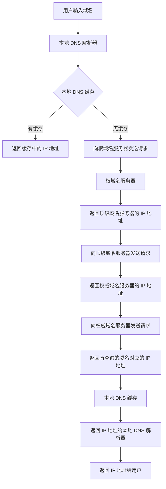
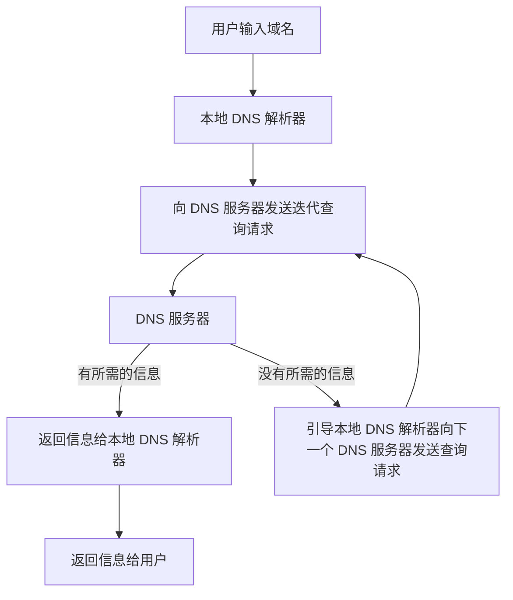

## 前言

对 DNS 学习和操作还记得是在学校里计算机网络实操中操作的。通过设置 DNS 来解析域名为 IP。有的时候也很奇怪一些破解软件通过 Host 文件来完成软件的破解，记忆深刻的是 老版本的Xmind 破解，就是通过 设置host 文件来进行破解的。还有实习的时候会将 公司仓库的ip地址配置在 host 文件中，不然无法下载公司仓库的依赖。借此就记录一下，复习 DNS 的过程，以及了解一下 Dnsmasq 这个软件。

现在，就带着为什么 Host 可以怎么神奇来查看这篇文章吧？道理很简单...

## Dnsmasq 使用虚拟机作为DNS服务器

**Dnsmasq**是一个[开源的](https://zh.wikipedia.org/wiki/开源)轻量级[DNS](https://zh.wikipedia.org/wiki/DNS)转发和[DHCP](https://zh.wikipedia.org/wiki/DHCP)、[TFTP](https://zh.wikipedia.org/wiki/TFTP)服务器，使用[C语言](https://zh.wikipedia.org/wiki/C語言)编写。Dnsmasq针对家庭局域网等小型局域网设计，资源占用低，易于配置。支持的平台包括Linux、BSD、Smoothwall、IP-Cop、floppyfw、Firebox、LEAF、Freesco, fli4l、CoyoteLinux及Android等，并且在dd-wrt、openwrt[路由器](https://zh.wikipedia.org/wiki/路由器)系统中也有使用。


1.按照  dnsmasq

```
yum install dnsmasq
```

2.修改配置文件 /etc/dnsmasq.conf

```bash
listen-address=::1,127.0.0.1
cache-size=1000
no-resolv
server=8.8.8.8
server=8.8.4.4
```


3.修改 /etc/resolv.conf

```bash
search localdomain
nameserver 127.0.0.1
```


4.启动 dnsmasq //出现问题请跳到出现问题目录寻找

```shell
systemctl start dnsmasq
systemctl stop dnsmasq
service dnsmasq start //低版本
```

5.查看启动状态

```shell
systemctl status dnsmasq
```


6.进行测试

未启动 dnsmasq 状态

```shell
 nslookup baidu.com
```


### 总结：

现在你已经学会了如何配置默认的 DNS 服务器了。那就可以自己看着官方文档，或者别的资料进行扩张。或者开洞脑筋，想想可以使用在什么地方。

一个很棒的中文文档 [dnsmasq - Arch Linux 中文维基 (archlinuxcn.org)](https://wiki.archlinuxcn.org/wiki/Dnsmasq)


## Dnsmasq 文档

### 1.安装 dnsmasq

可以使用`yum`来安装 dnsmasq。例如在 Centos 系统上，可以使用以下命令安装：

```shell
 yum install dnsmasq
```

### 2.基本命令

查看是否启动

```bash
journalctl -u dnsmasq.service

systemctl status dnsmasq
```

检查配置文件语法

```bash
dnsmasq --test
```

启动

```
systemctl start dnsmasq
service dnsmasq start //低版本
```


### 3.配置 dnsmasq

需要编辑 `/etc/dnsmasq.conf`

**DNS 服务器**

要在单台计算机上将 dnsmasq 设置为 DNS 缓存守护程序，请指定 `listen-address` 指令，添加本地主机 IP 地址：

```bash
listen-address=::1,127.0.0.1
```

使用此计算机在其 LAN IP 地址上侦听网络上的其他计算机，建议使用静态 LAN IP。例如：

```bash
listen-address=::1,127.0.0.1,192.168.1.1
```

>dnsmasq会同时监听本地主机的IPv6和IPv4地址，以及192.168.1.1这个IP地址。也就是说，当这三个IP地址中任意一个收到DNS请求时，dnsmasq都会对其进行响应。

使用 `cache-size=*size*` 设置缓存域名的数量（默认值为 `150`，硬限制为 `10000`）：

```bash
cache-size=1000
```


### 4.DNS 地址文件和转发

配置 dnsmasq 后，需要将本地主机地址添加为 `/etc/resolv.conf` 中的唯一名称服务器。这会导致所有查询都发送到 dnsmasq。

由于 dnsmasq 是存根解析器而不是递归解析器，因此必须设置转发到外部 DNS 服务器。可以通过 [openresolv](https://wiki.archlinuxcn.org/wzh/index.php?title=Openresolv&action=edit&redlink=1) 自动完成或在 dnsmasq 的配置中手动指定 DNS 服务器完成。

##### **openresolv 配置**

如果网络管理器支持 *resolvconf* 而不是直接更改 `/etc/resolv.conf`，可以使用 [openresolv](https://wiki.archlinuxcn.org/wzh/index.php?title=Openresolv&action=edit&redlink=1) [生成 dnsmasq 的配置文件](https://roy.marples.name/projects/openresolv/configuration/)。

编辑 `/etc/resolvconf.conf` 并将 loopback 地址添加为名称服务器，然后配置 openresolv 输出 dnsmasq 配置：

```shell
/etc/resolvconf.conf
# 使用本地名称服务器
name_servers="::1 127.0.0.1"
resolv_conf_options="trust-ad"

# 输出 dnsmasq 扩展配置和解析文件
dnsmasq_conf=/etc/dnsmasq-conf.conf
dnsmasq_resolv=/etc/dnsmasq-resolv.conf
```

>通过外部文件来引导 resolv.conf 文件，进行扩展配置


运行 `resolvconf -u` 创建配置文件。如果文件不存在，则 `dnsmasq.service` 无法启动。

编辑 dnsmasq 的配置文件使用 openresolv 生成的配置：

```bash
# 读取 openresolv 生成的配置文件
conf-file=/etc/dnsmasq-conf.conf
resolv-file=/etc/dnsmasq-resolv.conf
```


##### 手动转发

首先，必须将本地主机地址设置为 `/etc/resolv.conf` 中的唯一名称服务器：

```bash
nameserver 127.0.0.1
```

然后，必须在 dnsmasq 的配置文件中设置 `server=*server_address*` 指定上游 DNS 服务器地址。还要添加 `no-resolv`，以便 dnsmasq 不会非必要地读取只包含本地主机地址的 `/etc/resolv.conf`。

```bash
no-resolv

# 示例：Google 的名称服务器
server=8.8.8.8
server=8.8.4.4
```

现在，DNS 查询将使用 dnsmasq 解析，仅在缓存查询无结果时才会从外部服务器查询。


### 5.测试

要执行查找速度测试，请选择自 dnsmasq 启动以来未访问过的网站

```bash
 nslookup baidu.com
 drill archlinux.org | grep "Query time"
```

再次运行该命令将使用缓存的 DNS IP，如果正确设置了 dnsmasq，则查找时间会缩短：

```bash
$ drill archlinux.org | grep "Query time"
 Query time: 18 msec
$ drill archlinux.org | grep "Query time"
 Query time: 2 msec
```


### 6.出现的问题

failed to create listening socket for port 53: Address already in use

当启动dnsmasq服务时，如果出现“failed to create listening socket for port 53: Address already in use”错误消息，这通常意味着端口53已被占用，因为它是DNS服务的默认端口。

要解决此问题，可以采取以下措施之一：

1. 停止占用端口53的其他服务或进程。可以使用以下命令查找使用端口53的进程：

   ```bash
   lsof -i :53
   ```

然后，可以使用以下命令杀死该进程：

```bash
bashCopy code
sudo kill -9 <PID>
```


## DNS（域名系统）

### 域名系统的结构和层次：

#### 了解 DNS 的结构和层次，包括根域名、顶级域名、二级域名等，以及各级域名之间的关系。

域名系统（DNS）是互联网上用于将域名转换为 IP 地址的协议，它使用层次化的命名系统来管理域名。域名系统的结构和层次如下：

1. 根域名（Root Domain）：它是 DNS 树结构的顶层，包含了所有顶级域名（TLD）的信息。根域名对应的标识符是 "."（点号），但通常情况下我们不需要输入它。
2. 顶级域名（Top-Level Domain，TLD）：它是根域名下的直接子节点，通常代表一类组织或国家。比如 ".com"、".org"、".edu"、".cn" 等。
3. 二级域名（Second-Level Domain，SLD）：它是顶级域名下的直接子节点，通常用于标识具体的网站或组织。比如 "google.com"、"baidu.cn" 等。
4. 子域名（Subdomain）：它是二级域名的直接子节点，通常用于划分不同的服务或功能。比如 "mail.google.com"、"blog.bbc.co.uk" 等。

>⏰
>
>在 DNS 中，每个域名节点都有一个对应的 IP 地址，用于将域名映射到 IP 地址。当我们在浏览器中输入一个网址时，浏览器会首先向本地 DNS 服务器发送一个查询请求，如果本地 DNS 服务器没有相应的解析记录，它会向根域名服务器发送请求，然后逐级向下查询，最终获取到对应的 IP 地址并返回给浏览器，浏览器再根据 IP 地址与服务器建立连接，实现网页访问。


### DNS 解析过程：

#### 了解 DNS 解析过程中各个环节的流程和机制，包括 DNS 递归查询、DNS 迭代查询、DNS 缓存等。

当我们在浏览器中输入一个网址时，浏览器会先将该网址发送给本地 DNS 服务器，然后本地 DNS 服务器会进行 DNS 解析。


##### **DNS 递归查询**

DNS 递归查询是最常用的 DNS 查询方式。在递归查询中，本地 DNS 服务器会向根域名服务器发送一个请求，请求的内容是要查询的域名的顶级域名服务器的 IP 地址。根域名服务器会返回顶级域名服务器的 IP 地址，本地 DNS 服务器接着会向顶级域名服务器发送请求，请求的内容是要查询的域名的权威域名服务器的 IP 地址。顶级域名服务器会返回权威域名服务器的 IP 地址，本地 DNS 服务器接着会向权威域名服务器发送请求，请求的内容是要查询的域名的 IP 地址。权威域名服务器会返回所查询的域名对应的 IP 地址，本地 DNS 服务器最后将 IP 地址返回给浏览器。

##### 图例：





##### **DNS 迭代查询**

DNS 迭代查询是另一种 DNS 查询机制，它与 DNS 递归查询相反。在 DNS 迭代查询中，DNS 解析器会向一个特定的 DNS 服务器发送请求，并等待服务器返回信息。如果该服务器没有所需的信息，则它会引导解析器到下一个 DNS 服务器，直到找到所需的信息或者所有 DNS 服务器都被遍历完毕。

DNS 迭代查询相比于 DNS 递归查询，具有更高的安全性和可靠性。在 DNS 递归查询中，本地 DNS 解析器需要向根域名服务器查询域名的 IP 地址，然后继续向下查询。这种查询方式可能被黑客利用进行中间人攻击（Man-in-the-Middle Attack）。

而在 DNS 迭代查询中，本地 DNS 解析器只会向特定的 DNS 服务器查询，查询的过程中没有其他的 DNS 服务器介入。这样，DNS 迭代查询可以避免中间人攻击。

需要注意的是，DNS 迭代查询可能需要花费更长的时间来完成。因为 DNS 解析器需要依次向不同的 DNS 服务器查询，直到找到所需的信息。因此，在实际使用中，我们需要根据具体情况选择适当的 DNS 查询机制。

##### 图例：



##### **DNS 缓存**

DNS 缓存是指在 DNS 解析过程中，已经解析过的域名和 IP 地址的映射关系被缓存在本地的 DNS 解析器中，以便于以后再次查询同一个域名时能够快速地返回结果。DNS 缓存可以大大减少 DNS 查询时间，提高网络性能和用户体验。

1. 递归缓存：当本地 DNS 解析器收到一个 DNS 查询请求时，如果它需要向其他 DNS 服务器进行递归查询，那么它会在本地缓存中存储查询的结果。这样，在后续的查询中，如果有其他用户访问相同的域名，本地 DNS 解析器就可以直接从本地缓存中获取结果，而无需再次向其他 DNS 服务器发送查询请求。
2. 权威缓存：当 DNS 服务器接收到一个查询请求时，如果它是该域名的权威 DNS 服务器，那么它会在本地缓存中存储查询结果。这样，在后续的查询中，如果有其他用户访问相同的域名，该 DNS 服务器就可以直接从本地缓存中获取结果，而无需再次查询。


当 DNS 缓存中的 TTL 值过期时，本地 DNS 解析器会将缓存中的记录标记为过期或者删除。此后，再次查询该域名时，本地 DNS 解析器将会重新进行 DNS 解析，从而获取最新的域名解析结果。

需要注意的是，DNS 缓存是基于域名级别的，而不是基于 IP 地址级别的。因此，当同一个域名解析出来的 IP 地址发生变化时，本地 DNS 解析器需要重新进行 DNS 解析，并更新缓存中的记录。否则，缓存中的记录会失效，导致无法正常访问该域名。

>⏰
>
>在 Windows 系统中，DNS 缓存和 Hosts 文件是两个不同的机制，不会将 DNS 缓存保存在 Hosts 文件中。
>
>DNS 缓存可以通过命令行工具如 `ipconfig` /`displaydns` 来查看和管理。
>
>Hosts 文件是一个本地的文本文件，用于将特定的 IP 地址与特定的主机名进行映射，从而实现在本地解析域名的功能。在 Windows 系统中，Hosts 文件的默认路径为 C:\Windows\System32\drivers\etc\hosts。通过编辑 Hosts 文件，用户可以手动添加、删除或修改域名与 IP 地址之间的映射关系。


### 域名系统记录类型：

#### 了解 DNS 中不同类型的记录，包括 A 记录、CNAME 记录、MX 记录等，以及各种记录的作用和用法

1. A 记录（Address Record）：将域名映射到 IPv4 地址。例如，[www.example.com](http://www.example.com/) 可以被映射到 IP 地址 203.0.113.1。
2. AAAA 记录（IPv6 Address Record）：将域名映射到 IPv6 地址。例如，[www.example.com](http://www.example.com/) 可以被映射到 IPv6 地址 2001:0db8:85a3:0000:0000:8a2e:0370:7334。
3. CNAME 记录（Canonical Name Record）：将域名映射到另一个域名。例如，[www.example.com](http://www.example.com/) 可以被映射到 example.com。CNAME 记录通常用于为主机名指定别名，或者将一个域名的 DNS 记录指向另一个域名。
4. MX 记录是 DNS 中的一种记录类型，用于指定接收域名的电子邮件的邮件服务器。它是邮件交换协议（SMTP）使用的一部分，通过将 MX 记录指向正确的邮件服务器，可以确保邮件能够正常发送和接收。


### DNS 安全性：

#### 了解 DNS 在安全性方面存在的问题和解决方案，包括 DNS 劫持、DNS 缓存投毒等攻击手段，以及 DNSSEC 等安全协议。

DNS（Domain Name System）是互联网中非常重要的一个基础设施，它的主要作用是将域名转换成 IP 地址，使得网络设备能够互相通信。然而，由于 DNS 的开放性和分布式性，也为攻击者提供了机会，可能会对 DNS 进行各种攻击。


1. DNS 劫持：DNS 劫持是指攻击者篡改 DNS 请求或响应，将用户的域名解析到攻击者指定的恶意 IP 地址上。这可能会导致用户被重定向到恶意网站或受到其他攻击。

解决方案：使用 DNSSEC 签名来保护 DNS 解析过程。DNSSEC 通过数字签名和公钥加密等技术来确保域名解析的可靠性和完整性，防止 DNS 劫持和 DNS 欺骗攻击。

>DNSSEC（Domain Name System Security Extensions）是一种用于增强 DNS 安全性的扩展协议。它通过数字签名和公钥加密等技术来确保 DNS 解析的可靠性和完整性，防止 DNS 劫持、DNS 缓存投毒和 DNS 欺骗等攻击。
>
>DNSSEC 签名是 DNSSEC 协议的核心功能之一，它的主要作用是对 DNS 记录进行数字签名，确保 DNS 记录的真实性和完整性。DNSSEC 签名使用公钥加密技术，签名过程包括以下步骤：
>
>1. 生成密钥对：使用公钥加密技术生成一对公钥和私钥。公钥用于加密数据，私钥用于解密数据。
>2. 生成数字签名：使用私钥对 DNS 记录进行签名，生成数字签名。数字签名中包含了签名算法、公钥、DNS 记录和签名时间等信息。
>3. 将数字签名添加到 DNS 记录中：将数字签名添加到 DNS 记录中，形成 DNSSEC 签名记录。
>
>当用户请求 DNS 记录时，DNS 服务器将返回该 DNS 记录以及对应的数字签名记录。用户可以使用 DNSSEC 验证工具来验证数字签名的真实性和完整性，以确保 DNS 解析的可靠性和安全性。


2. DNS 缓存投毒：攻击者会向 DNS 服务器发送恶意响应，以污染 DNS 服务器的缓存，使得用户在向该 DNS 服务器请求域名解析时被引导到攻击者指定的恶意网站上。

解决方案：使用 DNS 缓存的 TTL（Time to Live）来限制缓存数据的存活时间，以便定期刷新 DNS 缓存。此外，可以使用 DNSSEC 来确保 DNS 数据的完整性和可靠性，避免 DNS 缓存被投毒。


3. DNS 空间攻击：攻击者可能会使用大量假的 DNS 请求来使 DNS 服务器不可用，这被称为 DNS 空间攻击。

解决方案：使用反向代理、CDN 等技术来分担 DNS 请求的负载，避免 DNS 服务器过载，提高 DNS 服务器的可用性和稳定性。


### DNS 优化和调优：

#### 了解 DNS 的性能优化和调优策略，包括 DNS 负载均衡、DNS 缓存优化等

1. DNS 负载均衡：DNS 服务器负载过高可能会导致 DNS 请求延迟或失败。为了提高 DNS 服务器的性能和可用性，可以使用负载均衡技术来分担 DNS 请求的负载，将 DNS 请求分散到多个 DNS 服务器上进行处理。
2. DNS 缓存优化：DNS 缓存可以减少 DNS 请求的数量，提高 DNS 响应速度。为了优化 DNS 缓存，可以设置缓存时间（TTL）来限制缓存数据的存活时间，以便定期刷新 DNS 缓存，避免缓存中存在过期或无效数据。此外，还可以通过增加 DNS 缓存大小和优化 DNS 缓存策略来提高 DNS 缓存的效率和可靠性。
3. DNS 服务器优化：优化 DNS 服务器的性能和可用性是提高 DNS 性能的关键。可以通过增加 DNS 服务器的处理能力、优化 DNS 服务器的配置、升级硬件等方式来提高 DNS 服务器的性能和可用性。
4. DNS 安全性优化：DNS 安全性的提高也是 DNS 性能优化的重要方面。可以采取 DNSSEC 签名、缓存刷新、负载均衡等技术来确保 DNS 解析的可靠性和安全性，避免 DNS 劫持、DNS 缓存投毒和 DNS 欺骗等攻击。


>1. dnsmasq：一种轻量级的 DNS 软件，可以作为 DNS 缓存服务器或 DHCP 服务器使用，支持 DNS 负载均衡和缓存优化等功能。
>2. Bind：一种常用的 DNS 服务器软件，可以提供高性能的 DNS 服务，支持 DNSSEC 签名、负载均衡和缓存优化等功能。
>3. Nslookup：一种常用的命令行工具，用于查询 DNS 记录和解析域名，可用于测试 DNS 解析的性能和可靠性。
>4. dig：也是一种常用的命令行工具，用于查询 DNS 记录和解析域名，可以输出详细的查询结果和调试信息。
>5. DNS Benchmark：一种 DNS 性能测试工具，可以测试各种 DNS 服务器的响应速度和性能，并显示最佳的 DNS 服务器选项。
>6. DNS Analyzer：一种 DNS 流量分析工具，可以监视和分析 DNS 流量，并提供 DNS 缓存优化和安全性建议。


### 总结：

回顾最初的问题：为什么需要通过配置 Host 文件来完成破解和下载依赖？

Host 文件通常用于将域名映射到 IP 地址，以便浏览器可以解析这些域名并访问相应的网站。在软件开发中，有些公司会使用私有的软件仓库来存储和管理项目依赖，这些仓库通常需要进行身份验证才能访问。

如果需要从公司的私有仓库中下载依赖项，但的电脑无法访问该仓库，可以通过编辑 Host 文件来解决该问题。可以将私有仓库的域名映射到一个可访问的 IP 地址上，这样的电脑就可以解析该域名并连接到私有仓库了。

具体来说，需要编辑 Host 文件并添加一行类似于以下内容的条目：

```
192.168.0.1  myprivaterepo.com
```
