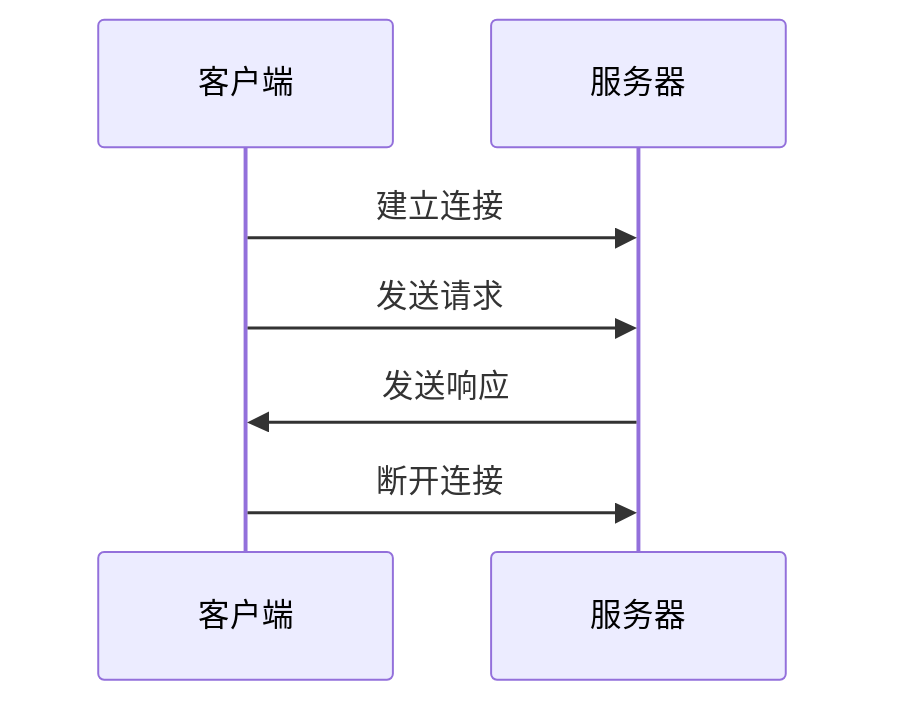
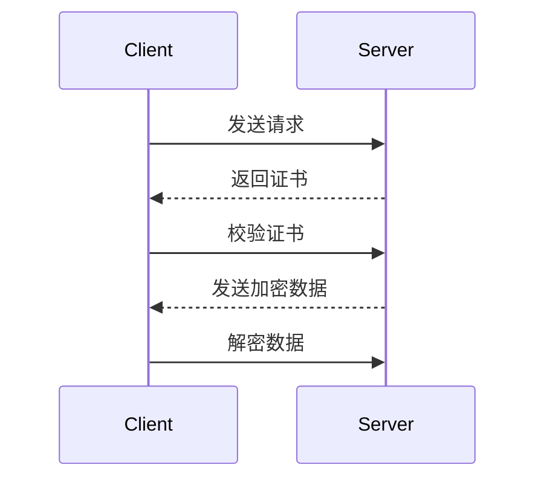

## HTTP基础知识

### • HTTP的发展历史

HTTP（Hypertext Transfer Protocol，超⽂本传输协议）是⼀种⽤于在 Web上进⾏数据通信的协议。HTTP的发展可以追溯到20世纪90年代初期，当时万维⽹（World Wide Web）开始流⾏起来，并且需要⼀种协议来传输Web⻚⾯。


HTTP/1.1：1999年，HTTP/1.1协议发布。该版本引⼊了持久连接和管道等机制，可以在单个TCP连接上发送多个HTTP请求，提⾼了通信效率。此外，HTTP/1.1 还引⼊了分块传输编码（Chunked Transfer Encoding）机制，允许服务器在传输响应数据时分成多个数据块传输，可以提⾼响应速度。


HTTP/2：2015年，HTTP/2协议发布。该版本引⼊了多路复和⼆进制分帧等新机制，可以在⼀个TCP连接上同时传输多个请求和响应，提⾼了通信效率。此外，HTTP/2还⽀持服务器推送和头部压缩等新特性。


HTTP/3：2020年，HTTP/3协议发布。该版本采⽤了基于 UDP的传输协议QUIC作为传输层协议，可以进⼀步提⾼通信效率。此外，HTTP/3还引⼊了零信令和连接迁移等新特性，可以加速建⽴连接和减少中断次数。


### • HTTP请求和响应消息的结构和格式


**HTTP请求消息由三部分组成**请求⾏、请求头部和请求正⽂

请求⾏：包含三个字段，分别是请求⽅法（GET、POST等）、请求URI和HTTP版本号。例如：GET /index.html  HTTP/1.1


请求头部（Request Headers）：包含多个键值对，⽤来描述请求消息的相关信息，例如请求的Host、User-Agent、Accept等。每个键值对之间使⽤回⻋换⾏符（\r\n）分隔。请求头部以⼀个空⾏（\r\n）作为结束。


请求正⽂（Request Body）：只有当请求需要提交数据时才会有请求正⽂。例如POST请求，就需要在请求正⽂中提交数据。请求正⽂的格式由Content-Type字段指定。


**HTTP响应消息由三部分组成**：状态⾏、响应头部和响应正⽂

状态⾏（Status Line）：包含三个字段，分别是HTTP版本号、状态码和状态描述。例如：HTTP/1.1 200 OK。


响应头部：和请求头部类似，包含多个键值对，⽤来描述响应消息的相关信息，例如响应的Content-Type、Content-Length等。


响应正⽂：响应消息的实际内容。响应正⽂的格式由Content-Type字段指定


### • HTTP状态码和其含义

**HTTP状态码主要分为以下五类：**

1xx：信息性状态码，表示服务器已接收到客户端的请求，但还需要进⼀步处理。

​	•100 Continue：请求成功，客户端可以继续发送请求。

​	•101 Switching Protocols：服务器已经理解客户端的请求，并将通过Upgrade消息头通知客户端采⽤不同的协议来完成此请求。


2xx：成功状态码，表示客户端的请求已经被成功地接收、理解、接受处理。

​	•200 OK：请求成功，服务器返回的数据在响应正⽂中。

​	•201 Created：请求成功，并且服务器已经创建了新的资源。

​	•204 No Content：请求成功，但响应正⽂为空。

3xx：重定向状态码，表示客户端需要采取进⼀步的操作才能完成请求。

​	•301 Moved Permanently：永久重定向，请求的资源已经被永久转移到新的URL上。

​	•302 Found：临时重定向，请求的资源已经被临时转移到新的URL上。

​	•304 Not Modified：客户端请求的资源未被修改，可以直接使⽤客户端缓存的版本。

4xx：客户端错误状态码，表示客户端发送的请求有错误。

​	•400 Bad Request：请求⽆效，服务器⽆法解析请求。

​	•403 Forbidden：请求被拒绝，没有权限访问资源。

​	•404 Not Found：请求的资源不存在。

5xx：服务器错误状态码，表示服务器在处理请求时发⽣了错误。

​	•500 Internal Server Error：服务器发⽣了未知的内部错误。

​	•503 Service Unavailable：服务器暂时⽆法处理请求，通常是由于服务器过载或维护⽽导致的


## HTTP消息头

### • HTTP响应消息头的常⻅字段和⽤法

HTTP响应消息头是服务器向客户端发送响应时携带的额外信息。这些信息以键值对的形式组成，放置在HTTP响应头部中，包含了响应的详细信息，可以让客户端更好地处理响应。下⾯是HTTP响应消息头的⼀些常⻅字段及其⽤法：

1、 Server： Server字段⽤于标识服务器的软件类型和版本号。客户端可以根据 Server字段，了解服务器端所使⽤的技术和能⼒。

2、 Content-Type： Content-Type字段⽤于指定响应正⽂的数据类型。例如，如果响应正⽂是HTML格式的数据，那么可以将Content-Type设置为"text/html"。

3、 Content-Length： Content-Length字段⽤于告诉客户端响应正⽂的⻓度，以便客户端可以正确地接收响应正⽂。

4、 Date： Date字段⽤于告诉客户端响应的⽣成时间。客户端可以根据Date字段，计算出响应的过期时间和缓存时间等。

5、 Expires： Expires字段⽤于告诉客户端响应的过期时间，以便客户端可以在过期时间之前使⽤缓存的响应，减少不必要的请求。

6、 Last-Modified： Last-Modified字段⽤于告诉客户端响应正⽂的最后修改时间。客户端可以根据Last-Modified字段，判断资源是否被修改过，并决定是否需要重新请求资源。

7、 ETag： ETag字段⽤于提供响应正⽂的实体标签，客户端可以使⽤ETag字段，判断资源是否被修改过，从⽽减少不必要的请求。

8、 Set-Cookie： Set-Cookie字段⽤于在响应中设置⼀个新的Cookie。服务器可以使⽤ Set-Cookie字段，向客户端发送存储在客户端的会话标识信息，以维护⽤户登录状态和⽤户的个性化设置


### • HTTP请求消息头的常⻅字段和⽤法

HTTP请求消息头是客户端向服务器端发送请求时携带的额外信息。这些信息以键值对的形式组成，放置在HTTP请求头部中，包含了请求的详细信息，可以让服务器端更好地处理请求。下⾯是HTTP请求消息头的⼀些常⻅字段及其⽤法：

1、 User-Agent： User-Agent字段⽤于标识发送请求的客户端应⽤程序或浏览器类型。服务器端可以根据不同的User-Agent字段，返回不同的响应结果，例如⼿机和PC端的响应结果可能不同。

2、 Host： Host字段指定了⽬标服务器的主机名和端⼝号，⽤于告诉服务器端请求的具体⽬标地址。

3、 Accept： Accept字段⽤于告诉服务器端，客户端所能接受的响应内容类型。例如，如果客户端只能接受JSON格式的响应，那么它可以将Accept字段设置为"application/json"。

4、 Content-Type： Content-Type字段⽤于指定请求正⽂的数据类型。例如，如果请求正⽂是JSON格式的数据，那么可以将Content-Type设置为"application/ json"。

5、 Authorization： Authorization字段⽤于携带客户端的身份验证信息，通常⽤于发送⽤户凭据以获取受保护的资源。

6、 Cookie： Cookie字段⽤于向服务器端传递存储在客户端的会话标识信息，通常⽤于维护⽤户登录状态和⽤户的个性化设置。

7、 Referer： Referer字段⽤于告诉服务器端，请求来源的URI地址。例如，当⽤户点击⼀个链接时，浏览器会发送包含Referer字段的请求，告诉服务器端请求来⾃哪个⻚⾯。

8、 Connection： Connection字段⽤于告诉服务器端，客户端请求完毕后是否需要保持连接。例如，如果客户端需要多次请求同⼀个资源，则可以将Connection 设置为keep-alive，以便服务器端保持连接并提⾼响应速度


### • Cookies和Session的使⽤

**Cookies和Session都是⽤于在Web应⽤程序中跟踪⽤户状态和维持会话的机制，但它们的实现⽅式和使⽤⽅法略有不同。**

1、Cookies Cookies是⼀种⽤于存储在客户端的⼩型数据⽂件。Web服务器使⽤响应头中的Set-Cookie指令来告诉客户端存储Cookie。每个Cookie都有⼀个名称、⼀个值和⼀个可选的过期时间。当客户端发送请求时，会⾃动将相应的Cookie附加到请求头中发送给服务器。

Cookies通常⽤于实现以下功能：

​	•会话跟踪：Cookies可以跟踪⽤户的登录状态和其他会话信息。

​	•个性化设置：Cookies可以存储⽤户的⾸选项和设置。

​	•记住我：Cookies可以让⽤户保持登录状态，避免需要反复登录。 Cookies的缺点是可以被客户端篡改，因此不应存储敏感信息。此外，如果Cookie中存储了⼤量数据，将会影响Web应⽤程序的性能。

2、Session Session是⼀种在服务器端跟踪⽤户状态和维护会话的机制。当⽤户⾸次访问Web应⽤程序时，服务器会为其创建⼀个唯⼀的Session ID，并将Session ID存储在Cookie中。当客户端发送请求时，服务器将使⽤ Session ID来查找⽤户的会话信息，⽽不是依赖于客户端提供的Cookie 数据。

 Session通常⽤于实现以下功能：

​	•会话跟踪：Session可以跟踪⽤户的登录状态和其他会话信息。

​	•安全性：Session可以避免客户端篡改会话数据。

​	•缓存：Session可以将临时数据存储在服务器端，避免将数据存储在Cookie中导致的性能问题。 Session的缺点是需要占⽤服务器资源，如果同时有⼤量⽤户访问，会导致服务器的负载过⼤。另外，如果Web应⽤程序需要部署在多台服务器上，需要使⽤⼀些共享Session的技术，例如数据库存储、⽂件存储等


## HTTP连接管理

### • HTTP连接的⽣命周期和过程

HTTP连接是指客户端和服务器之间建⽴的⽹络连接，⽤于传输HTTP 请求和响应。HTTP连接的⽣命周期可以分为以下⼏个阶段：

1 建⽴连接：客户端通过TCP三次握⼿与服务器建⽴连接。

2 发送请求：客户端通过连接向服务器发送HTTP请求消息。

3 服务器处理请求：服务器接收到客户端的请求消息后，开始处理请求，包括解析请求消息、处理业务逻辑等。

4 发送响应：服务器将处理结果封装成HTTP响应消息，并通过连接发送给客户端。

5 断开连接：客户端和服务器在收到对⽅的关闭请求后，通过 TCP四次挥⼿断开连接。

在HTTP连接的过程中，客户端和服务器之间会交换多个HTTP请求和响应消息。在同⼀个连接中，客户端和服务器可以发送和接收多个 HTTP请求和响应，从⽽避免了频繁建⽴和断开连接的开销。 HTTP连接的⽣命周期可以根据具体的应⽤场景进⾏调整，例如可以通过TCP Keep-Alive机制实现连接的复⽤，从⽽减少建⽴连接的开销；也可以通过连接池技术来管理连接，避免因为连接不够导致服务⽆法响应





### • HTTP持久连接的概念和实现

HTTP持久连接（HTTP Persistent Connection），也称为HTTP KeepAlive连接，是指客户端与服务器之间的TCP连接在完成⼀次请求之后不会⽴即关闭，⽽是保持连接的状态，以便更快地处理后续的HTTP请求和响应。

HTTP持久连接的实现⽅式是通过在HTTP头部添加⼀个Connection:  keep-alive字段来告诉服务器，这个连接是⼀个持久连接。当服务器接收到这个字段后，它会在响应头部添加相同的字段来确认这个连接是持久的。这样，在客户端发出下⼀个请求时，它会重⽤这个已经建⽴的连接，⽽不是重新建⽴连接，从⽽避免了建⽴TCP连接所需的时间和资源。 HTTP持久连接可以显著提⾼Web应⽤程序的性能，特别是在处理⼤量短请求的情况下。

由于HTTP持久连接可以避免频繁的TCP连接建⽴和关闭操作，因此它可以减少⽹络延迟和服务器负载，并提⾼吞吐量和响应时间。需要注意的是，虽然HTTP持久连接可以提⾼Web应⽤程序的性能，但它也可能导致⼀些问题，例如连接泄漏、内存泄漏和连接耗尽等问题。因此，Web服务器通常会实现⼀些机制来限制持久连接的数量和持续时间，以避免这些问题的出。

​	1 连接泄漏：Web服务器应该实现⼀个⾃动断开空闲连接的机制，例如空闲连接超过⼀定时间后强制关闭连接。此外，Web应⽤程序也应该在每个请求完成后显式地关闭连接，以确保连接及时返回到连接池。

​	2 内存泄漏：Web服务器和客户端应该正确地处理连接关闭事件，并释放所有与连接相关的资源。如果使⽤的是⻓时间运⾏的持久连接，则应该实现⾃动断开连接的机制。

>为了防⽌内存泄漏，Web服务器和客户端需要正确地处理连接关闭事件并释放所有与连接相关的资源。以下是⼀些示例配置和实现的解决⽅案：
>
>1 在Web服务器上，可以通过配置连接超时时间和最⼤空闲时间来⾃动关闭闲置的持久连接，以确保连接及时返回到连接池。例如，在Tomcat中，可以在server.xml⽂件中配置以下属性：
>
>```
>connectionTimeout="5000"
>maxKeepAliveRequests="100" keepAliveTimeout="60000"
>```
>
>连接超时时间设置为5秒，最⼤空闲时间设置为60 秒。这意味着如果连接空闲超过60秒，它将被⾃动关闭并返回到连接池中
>
>2 在Java客户端中，可以使⽤HttpURLConnection类来创建 HTTP请求，并通过设置其Connection属性来启⽤持久连接。在每个请求完成后，应该显式地关闭连接以确保连接及时返回到连接池。
>
>```java
>public class HttpExample {
>	 public static void main(String[] args){
> try {
>//创建URL对象
> URL url = new URL("http://example.com");
>//创建HttpURLConnection对象并打开连接
> HttpURLConnection connection = (HttpURLConnection) url.openConnection();
> connection.setRequestMethod("GET");
> connection.setUseCaches(true);
> connection.setRequestProperty("Connection","Keep-Alive");
>//处理响应
>	BufferedReader reader = new BufferedReader(new InputStreamReader(connection.getInputStream()));
>
>	String line;
>
>		while ((line = reader.readLine())!= null){
>		System.out.println(line);
>	}
>
>	reader.close();
>	//显式地关闭连接
>	 connection.disconnect();
>} catch (Exception e){
>	 e.printStackTrace();
>}
>}
>}
>```
>
>
>
>通过设置Connection属性来启⽤持久连接，并在每个请求完成后显式地关闭连接

​	3 连接耗尽：Web服务器应该实现连接池来管理持久连接的数量，并限制每个客户端或每个IP地址的最⼤连接数。如果达到了连接池的最⼤容量，则应该使⽤⼀些算法来选择关闭哪些连接。

>连接耗尽通常发⽣在⾼并发的场景中，即服务器并发处理请求数量⼤于其最⼤连接数的情况。此时服务器会拒绝新的连接请求或者响应变慢，导致服务不可⽤。为了解决连接耗尽的问题，我们可以实现以下⽅案：
>
>1 实现连接池管理：在连接池中维护⼀定数量的连接，可以避免每个请求都重新创建和销毁连接的开销。同时，连接池可以根据业务需求设置连接的最⼤数量和最⼤空闲时间，避免出现连接耗尽的情况。
>
>2 配置服务器参数：⼀些服务器软件（如Tomcat、Nginx等）可以配置最⼤连接数、最⼤线程数等参数，可以根据业务需求来设置。
>
>3 优化代码：在编写代码时，应该尽量避免在请求处理过程中⻓时间占⽤连接，⽐如在请求处理过程中等待外部资源（如数据库、⽂件等）的响应，可以使⽤异步操作来提⾼吞吐量，减少连接占⽤时间。
>
>4 负载均衡：通过使⽤负载均衡器，可以将请求分发到多个服务器上，从⽽提⾼整个系统的并发处理能⼒，减少单台服务器的连接耗尽问题


### • HTTP管道化连接的概念和实现

HTTP管道化连接（HTTP pipelining）是指在同⼀个TCP连接上连续发送多个HTTP请求，⽽⽆需等待上⼀个请求的响应。使⽤HTTP管道化连接可以显著提⾼HTTP请求的响应速度和吞吐量。 HTTP管道化连接的实现⽅式如下：

实现HTTP管道化连接的基本步骤如下：

1. 客户端向服务器发送多个HTTP请求，这些请求都使用同一个TCP连接。
2. 服务器接收这些请求，并按照接收到的顺序依次处理它们。
3. 服务器将每个请求的响应分别发送回客户端，也按照接收到的顺序依次发送。

在HTTP管道化连接中，客户端和服务器之间的通信顺序发生了变化。在传统的HTTP连接中，客户端发送一个请求并等待响应，然后再发送下一个请求。而在HTTP管道化连接中，客户端可以在等待第一个请求的响应时发送下一个请求。

需要注意的是，HTTP管道化连接并非所有的HTTP服务器都支持，因此在使用该技术时需要确保服务器支持该功能。此外，一些代理服务器和防火墙可能会阻止HTTP管道化连接，因此需要进行相应的配置。


## HTTP安全

### • HTTPS的概念和实现

HTTPS（Hypertext Transfer Protocol Secure）是⼀种通过加密通道进⾏数据传输的HTTP协议。它使⽤SSL（Secure Socket Layer）或TLS （Transport Layer Security）协议对HTTP数据进⾏加密，保证数据的机密性、完整性和不可抵赖性。相对于HTTP协议，HTTPS协议更为安全，常⽤于保护敏感信息的传输，例如⽹银⽀付、电⼦邮件、在线购物等。

HTTPS的实现主要涉及以下⼏个⽅⾯：

1 证书申请和安装：HTTPS需要使⽤数字证书来保证通信双⽅的身份和数据的完整性。通常情况下，⽹站需要从CA（Certificate  Authority）机构购买数字证书，并在Web服务器上安装证书。

2 SSL/TLS协议的⽀持：Web服务器和客户端需要⽀持SSL/ TLS协议，以便对HTTP数据进⾏加密和解密。Web服务器通常会预装 SSL/TLS协议⽀持，⽽客户端需要在浏览器中配置SSL/TLS⽀持。

3 HTTP请求的加密和解密：HTTPS协议需要对HTTP请求进⾏加密，以保证数据的机密性。客户端发送的HTTP请求需要先通过SSL/ TLS协议进⾏加密，然后再发送到Web服务器。Web服务器接收到请求后，需要先进⾏解密，才能进⾏处理。

4 数字证书的验证：在建⽴HTTPS连接时，客户端需要验证 Web服务器的数字证书，以确保通信双⽅的身份。客户端会检查数字证书中包含的信息，例如证书颁发机构、有效期等，以判断证书的合法性。

5 安全漏洞的防范：HTTPS协议不仅仅是对HTTP数据进⾏加密，还需要防范各种安全漏洞，例如中间⼈攻击、会话劫持等。为了防范这些安全漏洞，Web服务器需要配置安全策略，例如强制使⽤ HTTPS协议、使⽤安全的加密算法、配置访问控制等

##### https请求流程图



##### 使用Springboot自签证书

要在Spring Boot项⽬中使⽤SSL⾃签名证书，需要进行以下步骤：

1 创建⼀个证书在Linux服务器上使⽤OpenSSL创建⾃签名证书。可以按照以下步骤操作：

按照openssl工具

```shell
sudo apt-get update
sudo apt-get install openssl

```

```shell
sudo openssl req -x509 -nodes -days 365 -newkey rsa:2048
-keyout /etc/ssl/private/selfsigned.key -out /etc/ssl/certs/
selfsigned.crt
```


2.⽣成私钥和⾃签名证书

将证书添加到Spring Boot项⽬中将.crt和.key⽂件添加到的Spring Boot项⽬的resources⽬录中。


3 配置Spring Boot应⽤程序使⽤SSL 在的Spring Boot应⽤程序中，需要使⽤application.properties或 application.yml⽂件配置SSL。这是⼀个application.properties的例⼦：

```properties
server.port=8443
server.ssl.key-store-type=PKCS12
server.ssl.key-store=classpath:selfsigned.p12
server.ssl.key-store-password=password
server.ssl.key-password=password
```

请注意，需要将⾃签名证书转换为PKCS12格式。可以使⽤以下命令将.crt和.key⽂件转换为PKCS12格式：

```shell
openssl pkcs12 -export -in selfsigned.crt -inkey
selfsigned.key -out selfsigned.p12 -name "selfsigned"
```

将⽣成的selfsigned.p12⽂件放在resources⽬录中，并在 application.properties⽂件中设置server.ssl.key-store参数。

4 重启应⽤程序并访问的应⽤程序完成上述步骤后，可以重新启动Spring Boot应⽤程序并使⽤https:// localhost:8443访问的应⽤程序。

请注意，在⽣产环境中，建议使⽤受信任的证书颁发机构（CA）颁发的证书


### • TLS / SSL协议的概念和实现

TLS/SSL是⼀种安全协议，⽤于保护互联⽹通信中的敏感数据，例如密码、银⾏卡号、信⽤卡号等等。TLS（Transport Layer Security）是 SSL的继任者，它建⽴在传输层（Transport Layer）之上，提供端到端的安全性。

TLS/SSL实现了两个主要功能：

认证和加密。认证确保你正在与预期的服务器通信，⽽不是被中间⼈攻击，⽽加密则确保通信中的数据不能被第三⽅窃取。 TLS/SSL的实现基于公钥加密和对称加密。公钥加密⽤于身份验证和密钥协商，⽽对称加密则⽤于加密和解密数据。TLS/SSL还实现了⼀些协议和算法来提供完整性检查和抵御中间⼈攻击。在实现TLS/SSL时，通常需要使⽤数字证书来验证服务器的身份。数字证书包含服务器的公钥和相关信息，由受信任的第三⽅机构颁发。

客户端使⽤数字证书验证服务器的身份，并与服务器交换密钥。在Web应⽤程序中，可以通过配置Web服务器和使⽤合适的证书来启⽤ TLS/SSL。⼀些常⻅的Web服务器，如Apache和Nginx，提供了易于使⽤的配置选项来启⽤TLS/SSL。此外，⼀些Web框架，如Spring Boot，也提供了简单的配置选项来启⽤TLS/SSL


### •数字证书和证书颁发机构的作⽤

数字证书是⽤来保证通信安全的⼀种技术⼿段，它是由第三⽅证书颁发机构（Certificate Authority，简称CA）签发的⼀份包含公钥和其他相关信息的电⼦⽂档。数字证书的主要作⽤是验证通信双⽅的身份，并为双⽅的通信提供加密保护。

证书颁发机构是⼀个可信任的第三⽅机构，其主要⼯作是颁发数字证书和验证申请者的身份信息，以确保数字证书的有效性和真实性。证书颁发机构的作⽤在于向使⽤者提供了可靠的身份验证机制，使得使⽤者可以信任证书中包含的公钥，从⽽保证数据的安全性和完整性。

通常情况下，证书颁发机构还会对已颁发的数字证书进⾏监管和管理，如吊销已经过期的证书等。这些措施能够保证数字证书的有效性和可靠性，从⽽保证通信的安全性。


##  HTTP性能

### • HTTP缓存机制的实现和使⽤

HTTP 缓存机制可以提高 web 应用程序的性能，减少服务器端负载和响应时间，提高用户体验。在 HTTP 缓存机制中，浏览器会缓存静态资源（如图片、CSS 文件、JavaScript 文件等）的副本，当用户再次请求这些资源时，浏览器可以从本地缓存中获取资源，而不必再次从服务器上下载。

下面是 HTTP 缓存机制的实现和使用方式：

##### 1、缓存控制头

在 HTTP 响应头中使用 Cache-Control、Expires 和 Last-Modified 等字段来控制缓存。这些字段控制浏览器是否缓存响应，以及缓存时间和更新策略等方面。

例如，Cache-Control 可以控制缓存行为：

```
Cache-Control: max-age=3600, public
```

这个响应头表示资源可以缓存3600 秒，并且可以被公共缓存服务器缓存。

##### 2、ETag

ETag 是一种缓存验证机制，用于检测资源是否被修改过。当客户端请求一个资源时，服务器会计算出该资源的 ETag 值，并将 ETag 值返回给客户端。当客户端再次请求该资源时，客户端将 ETag 值发送给服务器。服务器将检查该 ETag 值是否与服务器上资源的 ETag 值相匹配，如果匹配则返回304 Not Modified 响应，客户端可以使用本地缓存。

例如：

```
ETag: "abcdefg"
```

##### 3、Last-Modified

Last-Modified 是一种缓存验证机制，用于检测资源是否被修改过。当客户端请求一个资源时，服务器会将资源的最后修改时间（Last-Modified）返回给客户端。当客户端再次请求该资源时，客户端将 Last-Modified 值发送给服务器。服务器将检查该值是否与服务器上资源的最后修改时间相匹配，如果匹配则返回304 Not Modified 响应，客户端可以使用本地缓存。

例如：

```
Last-Modified: Tue,01 Jan 2019 00:00:00 GMT
```

##### 4、使用 CDN

CDN（内容分发网络）可以加速静态资源的传输，将静态资源分发到多个地理位置的服务器上，使用户可以更快地访问资源。CDN 还可以提供缓存服务，将静态资源缓存在 CDN 边缘节点上，可以减轻原始服务器的负载并加速资源访问速度。

总的来说，使用 HTTP 缓存机制可以提高 web 应用程序的性能，缩短用户访问时间，并减轻服务器的负载。需要根据实际情况，使用适当的缓存策略，减少不必要的网络请求，提高 web 应用程序的效率和


### • HTTP压缩机制的实现和使⽤

HTTP 压缩机制可以通过在传输数据时对数据进行压缩来减少传输数据量，从而提高网络传输效率。这个机制可以用于减轻网络带宽压力、提高网络传输速度和节省服务器资源等。

下面是 HTTP 压缩机制的实现和使用方式：

##### 1、压缩算法

HTTP 压缩机制支持多种压缩算法，例如 gzip、deflate 等。其中，gzip 是最常用的压缩算法。在 HTTP 请求头中使用 Accept-Encoding 字段来告诉服务器支持的压缩算法。

例如：

```
Accept-Encoding: gzip, deflate
```

##### 2、压缩响应

当服务器收到 HTTP 请求时，服务器可以将响应数据进行压缩，并在 HTTP 响应头中添加 Content-Encoding 字段来告诉浏览器响应数据的压缩算法。

例如：

```cssCopy
Content-Encoding: gzip
```


##### 3、压缩阈值

在 HTTP 压缩机制中，可以通过设置压缩阈值来控制哪些数据需要被压缩。当数据的大小超过压缩阈值时，服务器将对数据进行压缩，否则不压缩。

例如：

```
Content-Length: 12345
```

在这个例子中，如果压缩阈值为1024 字节，当数据大小超过1024 字节时，服务器将对数据进行压缩。

总的来说，使用 HTTP 压缩机制可以减少网络传输数据量、提高网络传输效率和节省服务器资源等。需要根据实际情况，使用适当的压缩算法和压缩阈值，提高 web 应用程序的效率和性能。


### • HTTP分块编码的概念和实现

HTTP 分块编码（Chunked Encoding）是一种传输编码方式，可以在传输过程中动态的分割数据，将数据分成多个块（Chunk）分别进行传输，并且每个块在传输前都要携带一个该块的长度信息。这种方式可以帮助服务器在不知道响应内容长度的情况下，及时的将响应发送给客户端。

HTTP 分块编码的实现方法如下：

##### 1.将响应数据分成多个块

HTTP 分块编码是将响应数据分成多个块进行传输，因此需要将响应数据按照一定的规则分割成多个块。可以通过编程方式实现这一步骤。

##### 2.每个块携带长度信息

每个块在传输前都要携带一个该块的长度信息。长度信息是一个十六进制数，表示该块的长度（单位是字节）。长度信息和块之间需要使用 CRLF（回车换行符）进行分隔。

例如：

```
5
Hello
6
World!
0
```

在这个例子中，"5"表示第一个块的长度，"Hello"是第一个块的内容，"6"表示第二个块的长度，"World!"是第二个块的内容，"0"表示所有块已经传输完毕。

##### 3.在 HTTP 响应头中添加 Transfer-Encoding 字段

为了使用 HTTP 分块编码，需要在 HTTP 响应头中添加 Transfer-Encoding 字段，并将它的值设置为 chunked。这样，客户端在收到响应时就会自动使用 HTTP 分块编码进行数据传输。

例如：

```
HTTP/1.1 200 OK
Transfer-Encoding: chunked
Content-Type: text/html; charset=UTF-8
...
```

总的来说，HTTP 分块编码是一种传输编码方式，可以帮助服务器在不知道响应内容长度的情况下，及时的将响应发送给客户端。需要注意的是，在使用 HTTP 分块编码时，需要在 HTTP 响应头中添加 Transfer-Encoding 字段，并将它的值设置为 chunked。


## HTTP应⽤


### • RESTful API设计原则和最佳实践

RESTful是⼀种软件架构⻛格，它是基于HTTP协议和Web标准的设计⻛格，⽤于构建Web服务。在RESTful API设计中，遵循以下原则和最佳实践可以使API更加清晰、灵活、易⽤和可维护。

1 使⽤HTTP动词定义操作

2 RESTful API中的每个资源都应该使⽤HTTP动词来定义操作，如GET、POST、PUT、DELETE等。GET⽤于获取资源，POST⽤于创建资源，PUT⽤于更新资源，DELETE⽤于删除资源。

3 使⽤语义化的URL

4 RESTful API中的URL应该具有语义化，可以通过URL来理解API的资源和操作。例如，使⽤/places/china/beijing代表中国的北京地点资源，使⽤/places/china/beijing/photos表示北京地点的照⽚资源。

5 使⽤HTTP状态码

6 RESTful API应该使⽤HTTP状态码来表示请求的结果，如200表示成功，400表示请求格式错误，404表示资源未找到，500表示服务器错误等。

7 使⽤JSON格式作为数据传输格式

8 JSON格式是⼀种轻量级的数据传输格式，⼴泛⽤于Web开发。在RESTful API中，应该使⽤JSON格式作为数据传输格式，以便于客户端和服务器之间的交互和解析。

9 使⽤版本控制

10 RESTful API的版本应该通过URL或HTTP头来进⾏控制，以确保API的兼容性和稳定性。例如，使⽤/v1/places/china/beijing表示 API的第⼀个版本，使⽤/v2/places/china/beijing表示API的第⼆个版本。

11 设计清晰的错误处理机制

12 RESTful API应该提供清晰的错误处理机制，以便客户端可以处理异常情况。错误信息应该以JSON格式返回，并包含错误代码、错误描述和错误详细信息。

13 身份验证和授权

14 RESTful API应该提供身份验证和授权机制，以保护API的安全性和可⽤性。身份验证和授权可以通过HTTP头或请求参数来实现，常⻅的⽅式包括基本身份验证、OAuth和JWT等。

15 使⽤链接和资源嵌⼊

16 RESTful API应该使⽤链接和资源嵌⼊来构建复杂的数据模型。链接可以使API更加可发现和可浏览，⽽资源嵌⼊可以使API更加⾼效和易⽤。

Eg: 假设我们正在设计⼀个RESTful API，其中包含有关某个博客的信息。我们可以将博客的元数据（如标题、作者、创建⽇期等）放在⼀个链接中，同时在同⼀资源中嵌⼊博客的正⽂内容。⼀个GET请求可以返回如下的响应：

```json
HTTP/1.1 200 OK
Content-Type: application/json
Link: <http://example.com/blogs/123/metadata>;
rel="metadata"
{
"title": "RESTful API 设计原则和最佳实践",
"author": "ChatGPT",
"created_at": "2023-03-29T12:00:00Z",
"_links": {
"metadata": {
"href": "http://example.com/blogs/123/metadata",
"title": "Blog metadata"
}
},
"_embedded": {
"content": "<p>这是⼀篇关于RESTful API设计原则和最
佳实践的博客⽂章</p>"
}
}
```

>在这个例⼦中，响应包含了博客的元数据和正⽂内容。元数据链接被放在响应头中，以指示客户端可以请求有关博客的元数据。同时，正⽂内容被嵌⼊到响应体中，以提供客户端所需的完整博客信息


17 使⽤异步操作和缓存

18 RESTful API应该使⽤异步操作和缓存机制来提⾼API的性能和可伸缩性。异步操作可以使API更加⾼效和响应，⽽缓存机制可以减少⽹络延迟和服务器负载。


### • WebSockets和SSE的使⽤

WebSockets和SSE都是⽤于在客户端和服务器之间进⾏实时通信的技术，但它们在实现上有所不同。

WebSockets是⼀种双向通信协议，允许客户端和服务器之间在单个 TCP连接上进⾏实时通信。这种协议是基于事件的，这意味着⼀旦建⽴连接，服务器和客户端就可以随时发送数据，⽽⽆需客户端⾸先发起请求。WebSockets的优点包括实时性⾼、效率⾼、易于扩展等。它可以⽤于实现在线游戏、聊天应⽤、实时协作⼯具等等。

SSE（Server-Sent Events）是⼀种单向通信协议，仅允许服务器向客户端发送事件流。与WebSockets不同，SSE仍然使⽤HTTP连接，但是服务器可以在客户端与服务器之间建⽴⼀个⻓时间保持的连接，以便在服务器有新数据时可以将其推送到客户端。SSE的优点包括易于使⽤、实时性较⾼、可靠性好等。它可以⽤于实现实时更新的Web应⽤程序，例如股票⾏情、新闻feed等。

在使⽤WebSockets和SSE时，需要考虑⼀些实践原则：

1 考虑安全性：使⽤SSL / TLS加密协议以保护数据传输的安全。

2 考虑性能：使⽤适当的⼼跳时间来保持连接，以避免⽆⽤的 HTTP请求。对于WebSockets，使⽤压缩算法以减少数据传输量。

3 使⽤适当的数据格式：对于WebSockets，使⽤⼆进制数据格式以提⾼效率。对于SSE，使⽤JSON格式以提⾼可读性和可维护性。

4 考虑兼容性：检查浏览器⽀持性和版本兼容性，考虑使⽤ polyfill库来解决跨浏览器问题。总之，WebSockets和SSE是两种有效的实时通信技术，可以⽤于实现各种Web应⽤程序。选择哪种技术取决于应⽤程序的特定需求和限制。


### • HTTP /2的概念和实现

##### 概念：

HTTP/2是HTTP协议的⼀种更新版本，它的设计旨在提⾼现有HTTP/1.1协议的性能和效率。HTTP/2采⽤了⼀些新的技术，例如⼆进制分帧、多路复⽤、头部压缩和服务器推送，这些新技术能够使⽹站更快地加载，提⾼⽤户体验。

HTTP/2的实现是基于⼆进制分帧的通信模型。在HTTP/2中，所有的请求和响应都被分解成⼩的⼆进制帧，这些帧可以以任意顺序交错传输，这样就能够实现多路复⽤，也就是说，可以同时处理多个请求和响应。这个过程可以通过建⽴⼀条TCP连接来实现。

HTTP/2还引⼊了头部压缩技术，这个技术能够减少在请求和响应中发送的头部数据的⼤⼩，从⽽减少⽹络带宽的使⽤。这是通过使⽤专⻔的压缩算法来实现的。另外，HTTP/2还⽀持服务器推送，这是⼀种在客户端请求之前将资源主动推送给客户端的技术。服务器可以根据客户端请求的资源，提前将相关的资源推送给客户端，从⽽减少了客户端等待的时间。

总的来说，HTTP/2的概念和实现都是为了提⾼⽹络性能和效率。通过⼆进制分帧、多路复⽤、头部压缩和服务器推送等技术，HTTP/2能够更好地满⾜现代⽹络应⽤的需求，提⾼⽤户的体验


##### 实现：

1 服务器和客户端都必须⽀持HTTP/2协议。

2 服务器必须使⽤HTTPS协议，因为HTTP/2只能在加密的连接上运⾏。当然也可以通过使⽤HTTP/2 over QUIC协议，即HTTP/3协议来避免这个限制。⼀旦满⾜以上条件，就可以开始使⽤HTTP/2了。

下⾯是使⽤HTTP/2的步骤：

1 更新服务器软件：如果你使⽤的是Apache或Nginx等服务器软件，需要升级到最新版本，以⽀持HTTP/2协议。

2 配置服务器：需要启⽤HTTP/2协议并配置服务器以⽀持 HTTPS。

3 配置⽹站：需要确保⽹站中所有的资源都是通过HTTPS连接提供的。如果⽹站中有⼀些资源仍然使⽤HTTP连接，那么整个⽹站都将⽆法使⽤HTTP/2协议。

4 测试⽹站：使⽤浏览器的开发者⼯具，检查HTTP/2协议是否被正确地使⽤。需要注意的是，HTTP/2协议并不会⾃动提⾼⽹站的性能。为了获得最佳性能，还需要使⽤⼀些其他的技术，例如优化图⽚和脚本、缓存等
