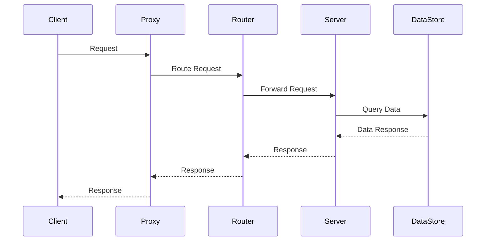

## 前言


## 几个问题？

**1、是RPC？它的作⽤是什么？**


**2、RPC的实现原理是什么？**


**3、RPC和RESTful API有什么区别？**


**4、Http 和 rpc 的区别：**


## RPC协议需要掌握的知识：


### 远程过程调⽤（RPC）概念：

#### RPC的定义、作⽤和优势

1 定义：RPC是⼀种协议，它定义了⼀种客户端和服务器之间进⾏通信的⽅式，使得客户端可以像调⽤本地函数⼀样调⽤远程的函数。在RPC中，客户端和服务器之间的通信通过⽹络进⾏，客户端发送请求消息，服务器接收请求并返回响应消息。

2 原理：RPC的基本原理是将本地函数调⽤转换为远程函数调⽤。在RPC中，客户端和服务器之间的通信通过协议进⾏，客户端通过发送请求消息向服务器发送请求，服务器接收请求并执⾏相应的远程函数调⽤，然后将结果封装在响应消息中返回给客户端。

>RPC客户端通过本地代理来调⽤远程服务端的函数，就像调⽤本地函数⼀样，主要通过以下步骤实现：
>
> 1 定义服务接⼝和⽅法：服务端需要定义服务接⼝和⽅法，客户端需要使⽤该接⼝来调⽤服务端的⽅法。
>
>2 ⽣成客户端和服务端的stub代码：客户端和服务端需要分别⽣成客户端stub代码和服务端stub代码，⽤于在本地代理层⾯处理客户端和服务端之间的通信。
>
> 3 客户端调⽤服务端⽅法：客户端在本地代理层⾯调⽤服务端⽅法，本地代理层将该请求转发到远程服务端。
>
> 4 远程服务端执⾏请求：服务端接收到客户端请求后，调⽤服务实现⽅法执⾏请求，并将结果返回给客户端。
>
>5 客户端接收返回结果：客户端接收到服务端返回的结果，本地代理层将结果转换为本地数据结构返回给客户端。
>
> 在整个过程中，客户端和服务端之间的通信过程主要包括序列化和反序列化，⽹络传输，以及错误处理和超时等。
>
>具体⽽⾔，客户端在调⽤服务端⽅法时，需要将参数序列化成⼆进制格式，通过⽹络传输到服务端。服务端接收到请求后，需要将请求参数反序列化成本地数据结构，并执⾏服务实现⽅法。
>
>执⾏完服务实现⽅法后，服务端需要将返回结果序列化成⼆进制格式，并通过⽹络传输回客户端。在整个过程中，客户端和服务端需要进⾏错误处理和超时控制，以保证RPC 调⽤的可靠性和稳定性。

3 作⽤：RPC的作⽤是使得不同的程序可以在不同的计算机之间进⾏通信和交互，从⽽形成⼀个分布式系统。使⽤RPC可以使得分布式系统的开发和维护变得更加容易，可以实现各种功能，如分布式计算、数据共享、负载均衡等。

4 优势：RPC的优势在于它可以使得分布式系统的开发变得更加容易和⾼效。RPC可以隐藏⽹络通信的细节，使得开发⼈员可以专注于业务逻辑的实现，⽽⽆需过多关注底层的通信细节。此外，RPC 还可以提⾼系统的可扩展性和可维护性，使得系统可以更好地应对⾼并发和⾼负载的情况。

5 缺陷：

​	1 协议缺陷：RPC协议虽然⽅便快捷，但也存在⼀些缺陷，例如在⽹络不稳定的情况下容易导致请求超时、重传等问题。在使⽤ RPC协议时，需要注意这些缺陷，以便及时解决问题。

​	2 服务注册与发现：在实际应⽤中，通常需要将服务注册到⼀个中⼼化的注册中⼼，以便于其他服务可以发现和调⽤。服务注册和发现的实现⽅式有多种，例如ZooKeeper 、etcd等。

​	3 服务治理：在分布式系统中，服务数量庞⼤，需要进⾏服务治理。服务治理包括服务的负载均衡、容错、监控等⽅⾯，以保证系统的稳定性和可靠性。服务治理的实现⽅式有多种，例如Netflix 的 Eureka 、Apache Dubbo的治理中⼼等。

​	4 安全性：在使⽤RPC协议时，需要考虑⽹络安全问题，如数据加密、身份验证、权限控制等。这些安全问题可以通过使⽤TLS 、 OAuth 、JWT等技术进⾏解决。需要注意的是，RPC协议只是分布式系统中的⼀部分，学习RPC协议还需要结合其他分布式系统相关的知识进⾏学习和应⽤。


#### RPC的原理

RPC （Remote Procedure Call，远程过程调⽤）是⼀种通过⽹络实现跨进程或跨机器调⽤的技术。它使得调⽤者能够像调⽤本地函数⼀样调⽤远程服务端的函数，从⽽实现分布式计算。

RPC的基本原理：

1 客户端调⽤：RPC客户端通过本地代理来调⽤远程服务端的函数，就像调⽤本地函数⼀样。客户端需要知道调⽤的函数名和参数，将这些信息打包成⼀个请求消息并发送给服务器。

2 传输协议：RPC通常使⽤TCP 、UDP 或HTTP等协议作为传输层协议，以确保数据在⽹络上传输的可靠性和安全性。

3 服务器处理：⼀旦服务器接收到请求消息，它会解析请求消息，确定要调⽤的函数以及传递给该函数的参数，并将结果打包成⼀个响应消息返回给客户端。

4 响应处理：⼀旦客户端接收到响应消息，它会解析响应消息，提取函数的返回值并进⾏处理。

5 错误处理和超时：如果RPC请求在传输过程中发⽣错误，客户端将收到错误响应消息。RPC还提供了超时机制，以避免客户端⼀直等待响应⽽⽆法继续执⾏程序。

RPC框架通常由四个组件组成：

1 客户端存根（Client Stub）：负责将请求消息打包成⽹络可传输的格式并将其发送到服务器端。

2 服务器端存根（Server Stub）：负责接收请求消息并将其解析为可供服务器端调⽤的参数。

3 传输层（Transport）：负责在客户端和服务器之间传输请求和响应消息。

4 序列化/反序列化组件（Serialization/Deserialization  Component）：负责将请求和响应消息转换为⼆进制数据，以便在传输过程中进⾏传输




>1. **请求（Request）**：客户端发送一个 RPC 请求到代理。
>2. **代理（Proxy）**：代理接收到请求后，将请求转发到路由器。
>3. **路由器（Router）**：路由器接收到请求后，将请求转发到服务端。
>4. **服务端（Server）**：服务端接收到请求后，执行相应的操作，并从数据存储中查询数据。
>5. **数据存储（DataStore）**：数据存储接收到查询请求后，将查询结果返回给服务端。
>6. **响应（Response）**：服务端将结果封装到一个响应中返回给路由器，最终返回给客户端。


### 序列化和反序列化机制：


序列化和反序列化是在数据传输和存储过程中常⽤的机制，它们⽤于将数据从⼀种格式转换为另⼀种格式。在分布式系统中，RPC通信也需要使⽤序列化和反序列化机制，以便在客户端和服务器之间传输和处理数据。

下⾯是关于不同的序列化和反序列化机制以及在RPC中使⽤它们的详细介绍：

#### JSON ：

JSON （JavaScript Object Notation）是⼀种轻量级的数据交换格式，易于阅读和编写。在JSON中，数据以键值对的形式表示，并使⽤⼤括号括起来。JSON⽀持多种编程语⾔，如Java 、 Python 、C#等。在RPC中，可以使⽤JSON进⾏序列化和反序列化，以便在客户端和服务器之间传输和处理数据。

#### XML ：

XML （Extensible Markup Language）是⼀种⽤于描述数据的标记语⾔，它可以⾃定义标记，并使⽤尖括号括起来。XML ⽀持多种编程语⾔，如Java 、Python 、C#等。在RPC中，可以使⽤ XML进⾏序列化和反序列化，以便在客户端和服务器之间传输和处理数据。

#### Protocol Buffers ：

Protocol Buffers 是Google开发的⼀种轻量级的序列化和反序列化机制，它可以将结构化数据转换为⼆进制格式，并⽀持多种编程语⾔。与JSON 和XML不同，Protocol Buffers使⽤预定义的消息格式，这意味着需要事先定义消息的结构和字段类型。在 RPC中，可以使⽤Protocol Buffers进⾏序列化和反序列化，以便在客户端和服务器之间传输和处理数据。

**在RPC中使⽤这些序列化和反序列化机制的步骤通常包括以下⼏个⽅⾯：**

1 在客户端和服务器之间定义消息格式和字段类型。

2 使⽤序列化机制将消息从对象格式转换为字节流格式。

3 将字节流发送到服务器端。

4 使⽤反序列化机制将字节流转换回对象格式。

5 服务器端根据消息的内容执⾏相应的逻辑操作。需要注意的是，不同的序列化和反序列化机制具有不同的优缺点，开发⼈员需要根据实际需求选择适合的机制。同时，在使⽤这些机制时，也需要考虑到数据的⼤⼩、传输速度、安全性等因素。

**在RPC中使⽤Protocol Buffers的步骤通常包括以下⼏个⽅⾯：**

1 定义Protocol Buffers消息的格式和字段类型。在RPC中，定义消息格式时需要考虑请求和响应的消息类型、消息字段和消息数据类型等。

2 在客户端和服务器之间使⽤Protocol Buffers进⾏序列化和反序列化。客户端将请求消息序列化为字节流，并发送到服务器；服务器接收请求消息的字节流，并将其反序列化为对象格式，然后执⾏相应的逻辑操作。服务器将响应消息序列化为字节流，并发送到客户端；客户端接收响应消息的字节流，并将其反序列化为对象格式。

3 使⽤Protocol Buffers API在代码中读取和操作消息。在客户端和服务器端的代码中，需要使⽤Protocol Buffers API来读取和操作消息

>Protocol Buffers是⼀种数据序列化格式，它可以将结构化数据转换为⼆进制格式，以便于在不同的应⽤程序之间传输和存储。Protocol Buffers 定义了⼀种语⾔中⽴的⼆进制格式，使得不同的应⽤程序可以使⽤不同的编程语⾔来读取和写⼊这些数据。
>
>Protocol Buffers的数据结构由三个部分组成：消息定义、字段定义和值。
>
>1 消息定义消息定义是Protocol Buffers的最基本的结构，它描述了⼀个数据对象的结构。消息定义是以proto⽂件的形式存在的，其中定义了⼀组字段，每个字段都有⼀个唯⼀的名称和类型。例如，下⾯是⼀个简单的消息定义：
>
>```javascript
>public class Person {
>        string name = 1 ;
>        int32 age = 2 ;
>}
>```
>
>这个消息定义表示⼀个⼈的对象，包含名字和年龄两个字段，其中名字是⼀个字符串类型，年龄是⼀个整数类型。
>
>2 字段定义字段定义⽤于描述消息定义中的每个字段，每个字段有⼀个名称、类型、唯⼀的编号和⼀些可选的选项。在上⾯的消息定义中，我们可以看到每个字段都有⼀个编号，这个编号是⽤来标识每个字段的。
>
>下⾯是⼀个字段定义的例⼦：
>
>```java
>string name = 1 ;
>```
>
>这个字段定义表示⼀个字符串类型的字段，它的名称是name，编号是1。
>
>3 值值是实际存储在Protocol Buffers消息中的数据。它可以是⼀个原始类型，如整数、浮点数、布尔值等，也可以是⼀个嵌套的消息对象。值可以使⽤消息定义中的字段名称来访问。
>
>例如，如果我们有⼀个Person对象的实例，我们可以使⽤以下代码来设置和获取值：
>
>```java
>Person person = new Person();
>person.name = "John";
>person.age = 30 ;
>string name = person.name;
>int age = person.age;
>```
>
>这个例⼦中，我们创建了⼀个Person对象的实例，并设置了它的名称和年龄。然后，我们使⽤点号操作符来获取每个字段的值。


### RPC如何处理并发请求、保证数据传输的可靠性和安全性

RPC（远程过程调⽤）是⼀个通信协议，⽤于在分布式系统中调⽤远程服务。在RPC的实现中，有⼀些重要的实现细节需要考虑，包括并发请求处理、数据传输的可靠性和安全性等等。

1 并发请求处理在RPC中，可能会有⼤量的并发请求需要处理。为了处理这些请求，⼀种常⻅的⽅法是使⽤线程池来管理并发请求。当⼀个请求到达时，将其放⼊线程池中，线程池将负责处理该请求，并在完成后将结果返回给调⽤⽅。使⽤线程池可以减少线程的创建和销毁开销，从⽽提⾼性能。

另外，⼀些RPC框架还会使⽤异步IO来处理请求。使⽤异步IO可以更好地利⽤CPU和⽹络资源，从⽽提⾼系统的吞吐量。在异步IO中，请求将被提交给IO线程进⾏处理，IO线程将负责等待数据传输完成，并在数据传输完成后通知应⽤程序进⾏处理。

2 数据传输的可靠性在RPC中，数据传输的可靠性⾮常重要。为了保证数据传输的可靠性，可以使⽤⼀些技术来处理通信故障、数据丢失和数据损坏等问题。⼀些常⻅的技术包括：

•重试机制：如果⼀次请求失败，可以尝试重新发送请求，以确保数据被正确传输。

•超时机制：可以设置超时时间，如果在规定时间内没有收到响应，则认为请求失败。

•⼼跳机制：可以定期发送⼼跳包以确保连接处于活动状态。

•数据校验：可以使⽤⼀些校验算法，例如CRC（循环冗余校验），以确保数据传输的完整性。

3 数据传输的安全性在RPC中，数据传输的安全性也⾮常重要。为了保证数据传输的安全性，可以使⽤⼀些加密算法来加密数据，以防⽌数据被窃取或篡改。⼀些常⻅的加密算法包括AES 、DES 、RSA等。另外，还可以使⽤数字签名来验证数据的完整性和真实性。数字签名使⽤公钥和私钥进⾏加密和解密，可以确保数据没有被篡改和伪造。为了更好地保护数据传输的安全性，还可以使⽤⼀些SSL（安全套接字层）或TLS（传输层安全）等协议来加密和验证数据。


>RPC框架需要考虑多种异常情况的处理，其中包括错误处理和超时控制，以确保RPC调⽤的可靠性和稳定性。
>
>RPC处理错误和超时等的基本原理：
>
>1 错误处理在RPC框架中，错误处理主要包括以下⼏个⽅⾯：
>
>•通信错误：如果客户端⽆法发送请求或服务端⽆法响应请求，RPC框架会抛出通信错误异常，客户端需要对异常进⾏处理并重试请求，直到请求成功为⽌。
>
>•服务端异常：如果服务端在处理请求时出现异常，RPC框架会将异常信息包装成RPC异常返回给客户端，客户端需要对异常进⾏处理，⽐如记录⽇志、回滚事务等。
>
>•客户端异常：如果客户端在发送请求时出现异常，RPC框架会抛出异常，需要在客户端代码中捕获并进⾏处理。
>
>2 超时控制在RPC框架中，超时控制主要是为了避免服务端处理请求时间过⻓，导致客户端⼀直等待，浪费资源。通常情况下，RPC框架会设置⼀个默认的超时时间，如果服务端在超时时间内没有返回响应，客户端会抛出超时异常。超时控制的具体实现通常有两种⽅式：
>
> •客户端超时控制：客户端发送请求时设置超时时间，如果服务端在超时时间内没有返回响应，客户端会抛出超时异常。
>
> •服务端超时控制：服务端处理请求时设置超时时间，如果处理时间超过超时时间，服务端会强制中断请求并返回超时异常
>
>


### gRPC

gRPC 是Google开发的⾼性能、开源的RPC框架。它使⽤Protocol  Buffers作为接⼝定义语⾔（IDL）来定义服务，可以⽣成多种语⾔的代码，包括C++、Java 、Python 、Go等。

gRPC基于HTTP/2协议，⽀持双向流和头部压缩，可以⾼效地处理⼤量请求和响应。它还⽀持客户端和服务端的流式处理，可以在⼀个连接上传输多个请求和响应。

优势：

•⾼性能：gRPC使⽤HTTP/2协议和Protocol Buffers，可以⾼效地处理⼤量请求和响应。

•多语⾔⽀持：gRPC⽀持多种语⾔，可以⽅便地在不同的平台和语⾔之间进⾏通信。

•⾃动⽣成代码：gRPC使⽤IDL来定义服务，并可以⾃动⽣成代码，减少了开发⼯作量。

•⽀持流式处理：gRPC⽀持客户端和服务端的流式处理，可以在⼀个连接上传输多个请求和响应。适⽤场景：需要⾼性能、多语⾔⽀持和流式处理的场景，例如⼤规模的微服务架构和实时数据处理系统

### Apache Thrift

Apache Thrift Apache Thrift是⼀个开源的跨语⾔RPC框架，由Facebook开发。它使⽤ IDL来定义服务，⽀持多种语⾔和平台，包括C++、Java 、Python 、 Ruby 、PHP等。

Thrift使⽤⾃⼰的⼆进制协议进⾏通信，⽀持同步和异步调⽤，还⽀持各种传输协议，包括TCP 、HTTP 、WebSocket等。

优势：

•跨语⾔⽀持：Thrift⽀持多种语⾔和平台，可以⽅便地在不同的平台和语⾔之间进⾏通信。

•多种传输协议：Thrift⽀持多种传输协议，包括TCP 、 HTTP 、WebSocket等。

•⾃定义协议：Thrift可以⾃定义⼆进制协议，可以根据需求进⾏优化。•⽀持同步和异步调⽤：Thrift⽀持同步和异步调⽤，可以根据需求进⾏选择。适⽤场景：需要跨语⾔⽀持和多种传输协议的场景，例如⼤规模的分布式系统和⾼性能的数据处理

### Apache Dubbo

Apache Dubbo是⼀种⾼性能、轻量级的开源RPC框架，由阿⾥巴巴开发。它⽀持多种协议，包括dubbo 、http 、hessian 、thrift等，⽀持负载均衡、容错、服务治理等特性。Dubbo提供了完整的服务治理解决⽅案，包括注册中⼼、路由、限流、降级等。

优势：

•⾼性能：Dubbo使⽤Netty作为底层通信框架，可以⾼效地处理⼤量请求和响应。

•⽀持多种协议：Dubbo⽀持多种协议，包括dubbo 、http 、 hessian 、thrift等，可以根据需求进⾏选择。

•完整的服务治理解决⽅案：Dubbo提供了完整的服务治理解决⽅案，包括注册中⼼、路由、限流、降级等，可以⽅便地进⾏服务管理。

•易于扩展：Dubbo⽀持插件机制，可以⽅便地进⾏扩展。适⽤场景：需要⾼性能、完整的服务治理解决⽅案和易于扩展的场景，例如⼤规模的分布式系统和微服务架构。


## 问题回答：

### 是RPC？它的作⽤是什么？

rpc是⼀种客服端和服务端的通信协议，属于应⽤层。它底层⽀持http协议，tcp ，udp点等常⻅的协议进⾏数据通信传输。通过会通过⼆进制数据来进⾏通信。它的作⽤是使客户端可以像调⽤⽅法⼀样调⽤远程服务的⽅法。


### RPC的实现原理是什么？

RPC的实现原理可以简单地描述为：

客户端发起、远程调⽤请求，包括调⽤的⽅法名和参数等信息，将请求数据打包成⼆进制格式，通过⽹络传输协议（如HTTP 、TCP等）发送给服务端。服务端接收到请求数据后进⾏解析，调⽤对应的⽅法进⾏处理，并将响应结果打包成⼆进制格式，通过⽹络传输协议返回给客户端。客户端接收到响应数据后进⾏解析，获取调⽤结果。


### RPC和RESTful API有什么区别？

RPC 和RESTful API都是⽤于在分布式系统中进⾏远程服务调⽤的通信协议。它们之间的主要区别在于：

•通信协议不同：RPC可以使⽤各种协议进⾏数据通信，如 HTTP 、TCP 、UDP等，⽽RESTful API则只能使⽤HTTP协议进⾏通信。

•数据交互格式不同：RPC通常使⽤⼆进制格式进⾏数据交互，⽽RESTful API使⽤常⻅的数据交换格式，如JSON 、XML等。

•设计理念不同：RPC的设计理念是让远程服务调⽤像本地调⽤⼀样简单，隐藏了底层通信细节，⽽RESTful API的设计理念是以资源为中⼼，通过HTTP⽅法来操作资源。


### Http 和 rpc 的区别：

HTTP 协议是一种应用层协议，通常用于在客户端和服务器之间传递数据，以实现 Web 页面的展示，它的特点是基于请求/响应的模式。

RPC（Remote Procedure Call）协议也是一种应用层协议，用于在不同的计算机系统之间进行远程过程调用。RPC 协议也是基于请求/响应的模式，不过它的目的是将方法调用抽象为远程过程调用，使得客户端可以像调用本地方法一样调用远程方法。

**HTTP 和 RPC 的本质区别在于它们的设计目的和使用场景不同。HTTP 协议更适合在 Web 页面上传递数据，而 RPC 协议则更适合在分布式系统中进行远程过程调用。**
