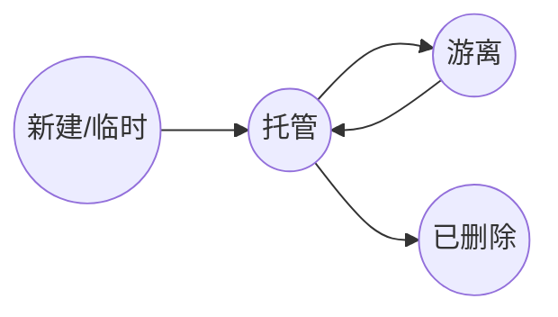
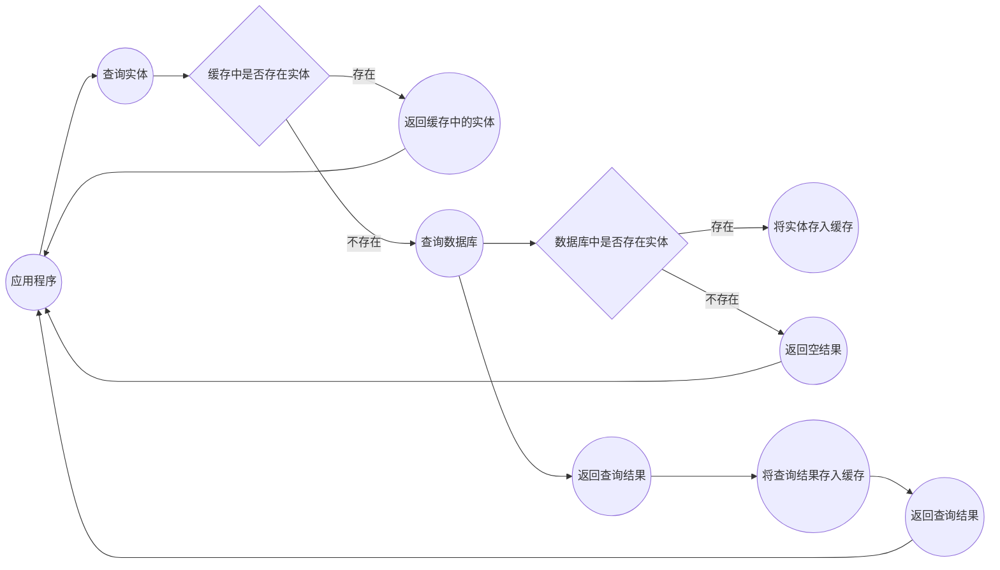

## 必备注解

### 须知须会的注解：

-   **@Entity：指示这个类是⼀个实体类，会与数据库中的表格进⾏映射。**
-   **@Table：指示实体类映射到的表格名称以及其它相关属性，如表格的模式（schema）、表格的索引、表格的约束等。**
-   **@Id：指示实体类中的某个属性是表格中的主键。**
-   **@GeneratedValue：指示主键的值是⾃动⽣成的。**
-   **@Column：指示属性与表格中的列之间的映射关系，包括列名称、类型、⻓度、是否允许为空等。**
-   **@Temporal：指示⽇期时间类型的属性与表格中的时间戳之间的映射关系。**

```
@Entity
​
public class Person {
​
    @Temporal(TemporalType.DATE)
    private Date birthDate;
​
    @Temporal(TemporalType.TIMESTAMP)
    private Date createdDate;
​
}
```

> birthDate 属性使用 @Temporal(TemporalType.DATE) 注解，它将被映射到数据库表格中的日期类型列。而 createdDate 属性使用 @Temporal(TemporalType.TIMESTAMP) 注解，它将被映射到数据库表格中的日期时间类型列。

-   @JoinColumn：⽤于表示实体类与另⼀个实体类之间的外键
-   @ManyToOne：⽤于表示实体类与另⼀个实体类之间的多对⼀关系。
-   @OneToMany：⽤于表示实体类与另⼀个实体类之间的⼀对多关系。

```
@Entity
@Table(name = "orders")
public class Order {
    @Id
    @GeneratedValue(strategy = GenerationType.IDENTITY)
    private Long id;
​
    @Column(name = "order_no")
    private String orderNo;
​
    @Column(name = "total_price")
    private BigDecimal totalPrice;
​
    @OneToMany(mappedBy = "order", cascade = CascadeType.ALL, orphanRemoval = true)
    private List<OrderItem> orderItems = new ArrayList<>();
​
    // getters and setters
}
​
​
@Entity
@Table(name = "order_items")
public class OrderItem {
    @Id
    @GeneratedValue(strategy = GenerationType.IDENTITY)
    private Long id;
​
    @Column(name = "product_name")
    private String productName;
​
    @Column(name = "quantity")
    private Integer quantity;
​
    @Column(name = "price")
    private BigDecimal price;
​
    @ManyToOne(optional = false)
    @JoinColumn(name = "order_id", referencedColumnName = "id")
    private Order order;
​
    // getters and setters
}
​
```

> 在@OneToMany注解中，我们使用mappedBy属性来指定OrderItem实体类中与Order实体类的关联属性的名称，即order属性。我们还使用cascade属性来指定级联操作的类型，这里设置为CascadeType.ALL表示级联保存、更新和删除。最后，我们使用orphanRemoval属性来指定当订单项被从订单中移除时是否将其从数据库中删除，这里设置为true表示删除。
>
> 在@ManyToOne注解中，我们使用optional属性来指定该关联是否可选，这里设置为false表示该关联是必须的。我们还使用@JoinColumn注解来指定外键列的名称和引用列的名称，从而建立两个实体类之间的关联关系。
>
> 一对多关系中，一方（这里是Order实体类）并不需要使用@JoinColumn注解来指定外键列。外键列是在多方（这里是OrderItem实体类）中使用@ManyToOne注解时指定的。
>
> **注意点：**
>
> **一方也可以使用当使用@JoinColumn注解来指定外键列。但是，@JoinColumn注解建立一对多关联关系时，mappedBy属性将不再需要，因为关联关系是在一方实体类中通过@JoinColumn注解指定的**
>
> **查询Order实体类时，Hibernate会自动将与之关联的OrderItem实体类的属性也查询出来**

-   @OneToOne：⽤于表示实体类与另⼀个实体类之间的⼀对⼀关系。

```
@Entity
@Table(name = "users")
public class User {
    @Id
    @GeneratedValue(strategy = GenerationType.IDENTITY)
    private Long id;
​
    @Column(name = "username")
    private String username;
​
    @OneToOne(mappedBy = "user", cascade = CascadeType.ALL, orphanRemoval = true)
    private UserProfile userProfile;
​
}
​
@Entity
@Table(name = "user_profiles")
public class UserProfile {
    @Id
    @GeneratedValue(strategy = GenerationType.IDENTITY)
    private Long id;
​
    @Column(name = "email")
    private String email;
​
    @OneToOne(fetch = FetchType.LAZY)
    @JoinColumn(name = "user_id")
    private User user;
​
}
​
```

> 使用@OneToOne注解建立一对一关联关系时，需要根据实际情况选择使用mappedBy属性或@JoinColumn注解来指定关联关系。如果关联关系存在于从实体类中，则使用mappedBy属性；如果关联关系存在于主实体类中，则使用@JoinColumn注解。

### 优化代码的注解：

-   @Embeddable：用于标记一个类为可嵌入的类，可以将其作为另一个实体类的属性进行持久化。
-   @Embedded：用于标记实体类中嵌入对象的属性，指定该属性与数据库表格中列的映射关系。

```
@Embeddable
public class Address {
    private String city;
    private String street;
    private String zipcode;
    
    // getters and setters
}
​
@Entity
public class User {
    @Id
    private Long id;
​
    private String username;
    
    private String password;
    
    @Embedded
    private Address address;
​
    // getters and setters
}
​
```

> 在数据库表格中，实体类 User 与可嵌入类 Address 的属性被合并在一起，对应于一张包含所有属性的表格。
>
> @Embedded 注解不是必须的，如果实体类中的属性与数据库表格中的列名相同，JPA 会自动将其进行映射，无需使用该注解。
>
> **这个好处就是拆分实体类。进行有效封装的话。数据条理清晰，虽然有的时候一个对象就可以完成的事情，拆分为两个确实有些麻烦了。但是，它好处也是也是蛮多的。**

-   @ElementCollection：用于标记实体类中集合类型的属性，将集合中的元素作为单独的实体进行持久化。该注解需要与 @CollectionTable、@Column 或 @JoinColumn 注解一起使用，用于将集合类型的属性进行持久化。

```
@Entity
public class User {
    @Id
    private Long id;
​
    private String username;
    
    private String password;
    
    @ElementCollection
    @CollectionTable(name = "user_emails", joinColumns = @JoinColumn(name = "user_id"))
    @Column(name = "email")
    private List<String> emails;
​
    // getters and setters
}
​
```

> 看使用很清晰表面：链接`user_emails`表，`user_id`作为关联字段，从`user_emails`返回`emails`字段
>
> 使用 @ElementCollection 注解将实体类 User 的 List<String> 类型的 emails 属性标记为集合类型，并指定其与数据库表格中列的映射关系

-   @OrderBy：用于指定实体类中集合属性中元素的排序规则。该注解需要与 @OneToMany 或 @ManyToMany 注解一起使用，用于指定集合类型属性的排序规则。

```
@Entity
public class Book {
    @Id
    private Long id;
​
    private String name;
    
    @OneToMany(mappedBy = "book")
    @OrderBy("pageNo ASC")
    private List<Page> pages;
​
    // getters and setters
}
​
@Entity
public class Page {
    @Id
    private Long id;
​
    private Integer pageNo;
    
    private String content;
    
    @ManyToOne
    private Book book;
​
    // getters and setters
}
​
​
@Entity
@OrderBy("name ASC")
public class Book {
    @Id
    private Long id;
​
    private String name;
    
    @OneToMany(mappedBy = "book")
    private List<Page> pages;
​
    // getters and setters
}
​
```

> @OrderBy 注解仅用于指定集合类型属性的排序规则，而不用于指定实体类本身的排序规则
>
> 其实这个注解还是挺好用的，可以设置默认的排序规则。如果需要覆盖只要再 JPA 中添加对应的排序规则即可。
>
> 实体类中使用的排序注解只对通过 JPA 进行的查询操作起作用
>
> 如果同时在实体类中使用了排序注解和在 SQL 查询语句中使用了 ORDER BY 子句，那么 SQL 查询语句中的排序规则会覆盖实体类中的排序注解

-   @DiscriminatorColumn、@DiscriminatorValue：用于实现继承映射策略，指定实体类的区分列和取值。

```
@Entity
@Inheritance(strategy = InheritanceType.SINGLE_TABLE)
@DiscriminatorColumn(name = "employee_type", discriminatorType = DiscriminatorType.STRING)
public abstract class Employee {
    @Id
    @GeneratedValue(strategy = GenerationType.IDENTITY)
    private Long id;
​
    private String name;
​
    private String gender;
​
    private String contact;
​
    private BigDecimal salary;
​
    // 省略 getter 和 setter
}
​
@Entity
@DiscriminatorValue("S")
public class SalariedEmployee extends Employee {
    // 省略额外属性和方法
}
​
​
@Entity
@DiscriminatorValue("H")
public class HourlyEmployee extends Employee {
    // 省略额外属性和方法
}
​
​
```

> 一个员工管理系统，其中有两种类型的员工：薪水雇员（SalariedEmployee）和小时工（HourlyEmployee）。这两种员工都有基本信息（姓名、性别、联系方式等）以及工资信息（薪水或时薪）。
>
> 我们可以定义一个 Employee 父类，包含基本信息和工资信息，然后定义两个子类 SalariedEmployee 和 HourlyEmployee 分别表示薪水雇员和小时工。使用 JPA 的继承映射策略，我们可以将这三个实体类映射到同一个表中，并通过一个名为 "employee_type" 的字段来区分不同类型的员工。
>
> | id | name | gender | contact | salary | employee_type |
> | -- | ---- | ------ | ------- | ------ | ------------- |
> | 1  | 张三   | 男      | 1380000 | 10000  | S             |
> | 2  | 李四   | 女      | 1390000 | 6000   | S             |
> | 3  | 王五   | 男      | 1360000 | 5000   | H             |
> | 4  | 赵六   | 女      | 1370000 | 20     | H             |
>
> 子类也有自生对应的表结构
>
> 如果此时，我们查询 employeeType 字段的值为 "S" 的值，那么返回的结果对应则是它的子类数据。
>
> **其实，这个确实有那么一点味道，如果进行数据库拆表操作的话。使用这个注解，真的能方便我们做很多事情**

-   @MappedSuperclass：用于标记一个类为映射父类，将其属性作为子类的属性进行持久化。通常用于封装实体类的公共属性和方法，以提高代码的复用性和可维护性

```
@MappedSuperclass
public class BaseEntity {
    @Id
    @GeneratedValue(strategy = GenerationType.IDENTITY)
    private Long id;
    private Date createTime;
    private Date updateTime;
​
    // getters and setters
}
​
@Entity
@Table(name = "user")
public class User extends BaseEntity {
    private String username;
    private String password;
​
    // getters and setters
}
​
@Entity
@Table(name = "order")
public class Order extends BaseEntity {
    private String orderNo;
    private BigDecimal amount;
​
    // getters and setters
}
​
```

> 这个注解也是优化代码结构的一个好注解。
>
> 此时的父类并不会再数据库生产对应的表结构，而子类会继承父类中的属性和方法，并且在数据库中生成对应的表结构。
>
> 这也这些对象就可以省略一些不必要的字段。
>
> 如果在子类中重新定义了父类中已有的属性，那么 JPA 会优先使用子类中重新定义的属性，而不是使用父类中的属性。这个过程称为属性的覆盖。

-   @Version：用于标记实体类中乐观锁的版本属性，每次更新时自动递增并检查版本冲突。

```
@Entity
public class User {
    @Id
    private Long id;
    private String name;
    @Version
    private Long version; // 添加 @Version 注解
​
    // getter 和 setter 略
}
​
```

> version 属性上添加了 @Version 注解，表示该属性是实体对象的版本号。当更新实体对象时，JPA 会检查该实体对象的 version 属性是否和数据库中的一致，如果一致，则更新成功，否则更新失败。
>
> 需要注意的是，@Version 注解只能用在基本数据类型和包装类型上，且必须是 Long 或 Integer 类型。此外，每个实体类只能有一个 @Version 属性。
>
> **需要注意：**
>
> 使用乐观锁机制会对性能有一定的影响，因为需要在每次更新数据时都需要查询数据库中的版本号。
>
> 还要注意版本号溢出的问题，如果一个实体类的更新操作十分频繁，将`version`的值

## 花式查询

### 接口查询：

基于接口查询是JPA中的一种查询方式，通过继承JpaRepository等接口，使用Spring Data JPA提供的基本查询方法，或者自定义接口方法进行查询。

Spring Data JPA提供的基础Repository接口列表：

1.  CrudRepository：提供了基本的CRUD操作，包括保存、删除、查询等。
0.  PagingAndSortingRepository：继承了CrudRepository接口，增加了分页和排序查询功能。
0.  JpaRepository：继承了PagingAndSortingRepository接口，增加了更丰富的查询功能，如批量操作、动态查询等。

```
public interface UserRepository extends JpaRepository<User, Long> {
    // 根据用户名查找用户
    User findByUsername(String username);
    // 根据用户名和密码查找用户
    User findByUsernameAndPassword(String username, String password);
    // 根据用户名模糊查询用户
    List<User> findByUsernameLike(String username);
    // 根据年龄范围查询用户
    List<User> findByAgeBetween(Integer minAge, Integer maxAge);
    //排序
    List<User> findAll(Sort sort);
    //按照指定的排序方式和分页条件查询数据。
    List<User> findAll(Pageable pageable)；
    //分组操作需要配合其他接口完成，后面再说...
    
}
​
```

> 可自定根据名称进行查询，简单方便，见名知其意。
>
> `Sort`对象用于指定排序方式，可以通过`Sort.by(Sort.Order...)`方法创建一个`Sort`对象，并传入一个或多个`Sort.Order`对象来指定排序规
>
> ```
> Sort sort = Sort.by(Sort.Order.desc("id"), Sort.Order.asc("age"));
> ```
>
> `Pageable`对象用于分页查询，它可以通过`PageRequest.of(int page, int size, Sort sort)`方法创建，其中`page`参数表示查询的页码（从0开始），`size`参数表示每页的大小，`sort`参数表示排序规则，可以为null。
>
> ```
> Sort sort = Sort.by(Sort.Order.desc("id"));
> Pageable pageable = PageRequest.of(1, 10, sort);
> ```
>
> 查询结果是一个`Page`对象
>
> ```
> int pageNumber = page.getNumber(); // 当前页码，从0开始
> int pageSize = page.getSize(); // 每页大小
> int totalPages = page.getTotalPages(); // 总页数
> long totalElements = page.getTotalElements(); // 总记录数
> List<?> ? = page.getContent(); // 当前页的学生列表
> ```

4.  JpaSpecificationExecutor：提供了动态查询功能，可以根据不同的条件组合生成不同的查询条件。

```
//查询年龄大于等于指定值的用户
public Specification<User> ageGreaterThanOrEqualTo(int age) {
    return public Specification<User> ageGreaterThanOrEqualTo(int age) {
    return (root, query, criteriaBuilder) ->
        criteriaBuilder.greaterThanOrEqualTo(root.get("age"), age);
}

List<User> users = userRepository.findAll(ageGreaterThanOrEqualTo(18));

}

List<User> users = userRepository.findAll(ageGreaterThanOrEqualTo(18));


//查询名字以指定字符串开头的用户
public Specification<User> nameStartsWith(String prefix) {
    return (root, query, criteriaBuilder) ->
        criteriaBuilder.like(root.get("name"), prefix + "%");
}

List<User> users = userRepository.findAll(nameStartsWith("xiaoming"));

//查询名字包含指定字符串的用户，并按年龄降序排序
public Specification<User> nameContainsAndAgeOrderByAgeDesc(String keyword) {
    return (root, query, criteriaBuilder) -> {
        Predicate namePredicate = criteriaBuilder.like(root.get("name"), "%" + keyword + "%");
        query.orderBy(criteriaBuilder.desc(root.get("age")));
        return namePredicate;
    };
}

List<User> users = userRepository.findAll(nameContainsAndAgeOrderByAgeDesc("Smith"));
```

> root和query是必需的，而criteriaBuilder则是可选的，可以根据具体的查询需求来决定是否使用它.
>
> 说实话，这个使用

5.  QueryByExampleExecutor：提供了通过实例对象进行查询的功能，可以根据实例对象的属性值进行查询。

```
@Repository
public interface StudentRepository extends JpaRepository<Student, Long>, QueryByExampleExecutor<Student> {


}

public void test(){

    Student exampleStudent = new Student();
    exampleStudent.setName("张三");
    exampleStudent.setAge(18);

    Example<Student> example = Example.of(exampleStudent);

    List<Student> students = studentRepository.findAll(example);


    ExampleMatcher matcher = ExampleMatcher.matching()
        .withIgnorePaths("id") // 忽略id属性
        .withMatcher("name", match -> match.startsWith()) // name属性模糊匹配开头
        .withMatcher("age", match -> match.lessThan(30)); // age属性小于30

    Student student = new Student();
    student.setName("John");
    student.setAge(25);

    Example<Student> example = Example.of(student, matcher);

    Sort sort = Sort.by(Sort.Order.desc("id"));

    List<Student> students = studentRepository.findAll(example,sort);


}
```

> `QueryByExampleExecutor`是Spring Data JPA提供的一种查询方式，它通过示例对象来进行查询，即将一个实例对象作为查询条件，通过匹配该实例对象的非空属性来生成查询条件。这种查询方式简单易用，可以避免手动拼接SQL语句的繁琐和容易出错。
>
> 需要注意的是，`QueryByExampleExecutor`仅支持简单的属性类型和关联实体类型的查询，不支持复杂的嵌套类型查询。同时，如果示例对象中有多个属性都设置了值，那么它们之间的关系默认是"与"的关系，即查询结果是这些条件的交集。如果需要使用"或"的关系，需要使用`ExampleMatcher`进行设置。
>
> 在使用`Example`查询时，实体类中的属性要求必须是简单类型（如String、Integer等），而不能是复杂类型（如List、Set等）。同时，对于属性值为null的情况，在使用`Example`查询时也需要特别注意。如果查询条件中的某个属性值为null，则该属性默认会被忽略。如果需要查询值为null的记录，可以使用`ExampleMatcher`的`withNullHandler`方法来处理。

6.  SimpleJpaRepository：是JpaRepository的默认实现，实现了更为复杂的查询操作。

> `SimpleJpaRepository`是Spring Data JPA提供的默认实现类，它实现了`JpaRepository`、`PagingAndSortingRepository`和`QueryByExampleExecutor`等多个接口，提供了基础的增删改查和分页、排序、Example查询等功能。
>
> 在`SimpleJpaRepository`中，针对不同的方法，会使用不同的实现方式，以提高查询性能。例如，对于`findAll`方法，如果查询结果小于1000条，则会使用`findAll`方法内置的查询语句；如果查询结果大于1000条，则会使用`findAll`方法中的JPA Criteria API来构建查询语句，以提高查询性能。
>
> `SimpleJpaRepository`还提供了一些扩展方法，例如`deleteInBatch`、`findAllById`等，使得开发人员可以更加便捷地实现复杂的数据操作需求。

#### 总结:

> 1.  如果只需要基本的CRUD操作，可以选择继承CrudRepository或JpaRepository接口。
> 0.  如果需要分页查询或排序功能，可以选择继承PagingAndSortingRepository或JpaRepository接口。
> 0.  如果需要更加灵活的动态查询功能，可以选择继承JpaSpecificationExecutor接口，自定义Specification实现查询条件的拼接。
> 0.  如果需要通过实例对象进行查询，可以选择继承QueryByExampleExecutor接口。
> 0.  如果需要自定义查询方法，可以在继承JpaRepository等接口的基础上，定义自己的Repository接口并实现自定义方法。
>
> **基于接口查询，使用上面一些方法再配合之前说到的注解，可以解决我们 75% 的查询需求了。对于多表操作，我们也可以使用注解或者拆分 sql 语句来完成这些任务，也可以通过自定义sql语句来完成**
>
> 在工作做中，
>
> 简单的增删改查可以直接通过 `QueryByExampleExecutor`接口完成。不过缺点就是无法很好的复用，好处就是快准狠，想要什么直接 new 一个查询的对象出来，直接使用。
>
> 使用`JpaRepository`已经可以解决大部分的简单的查询，做一些简单增删改查已经够用了

### JPQL查询：

JPQL（Java Persistence Query Language）语言执行查询。JPQL是一种与特定数据库无关的查询语言，类似于SQL，但使用对象和实体类的名称而不是表和列的名称。

**使用@Query**

```
import org.springframework.data.jpa.repository.JpaRepository;

public interface UserRepository extends JpaRepository<User, Long> {
    // 添加自定义查询方法
    @Query("SELECT u FROM User u WHERE u.age > :age")
    List<User> findByAge(int age);

    @Query("SELECT u FROM User u ORDER BY u.lastName ASC")
    List<User> findAllUsersOrderByLastName();

    @Query("SELECT u.age, COUNT(u) FROM User u GROUP BY u.age")
    List<Object[]> countUsersByAge();

    @Query("SELECT u FROM User u JOIN u.department d WHERE d.name = :departmentName")
    List<User> findUsersByDepartment(String departmentName);
    // ...
}
```

> 在使用 `@Query("SELECT u FROM User u JOIN u.department d WHERE d.name = :departmentName")`进行多表操作的时候，需要注意实体类中做好关联相关的注解。如果在 @Query 中编写了关联关系，它的优先级会比实体类中定义的关系高。
>
> **注意点：**
>
> 1.  JPQL查询使用实体类和属性的名称，而不是数据库表和列的名称。确保实体类和属性名称与数据库映射一致。
> 0.  使用命名参数进行参数绑定，使用冒号（:）后跟参数名称。例如，`:age`是一个命名参数。
> 0.  确保查询中使用的属性类型与实际数据库列的类型匹配，以避免类型转换错误。
> 0.  使用IS NULL或IS NOT NULL来处理NULL值。例如：`WHERE u.email IS NULL`。
> 0.  JPQL支持一些内置的函数和操作符，如CONCAT、LOWER、UPPER、LIKE等。确保正确使用这些函数和操作符。
> 0.  JPQL查询的性能取决于数据库和数据模型的结构。使用适当的索引、缓存策略和优化技巧来提高查询性能。

**使用EntityManager.createQuery方法**

`EntityManager`的`createQuery()`方法是使用JPQL执行查询的一种方式。它允许在运行时创建一个`Query`对象，并使用该对象执行查询操作。

```
@Entity
public class User {
    @Id
    @GeneratedValue(strategy = GenerationType.IDENTITY)
    private Long id;
​
    private String name;
​
    @ManyToOne
    @JoinColumn(name = "department_id")
    private Department department;
​
    // Getters and setters
}
​
@Entity
public class Department {
    @Id
    @GeneratedValue(strategy = GenerationType.IDENTITY)
    private Long id;
​
    private String name;
​
    // Getters and setters
}
​
import javax.persistence.EntityManager;
import javax.persistence.PersistenceContext;
​
@Service
public class MyService {
    @PersistenceContext
    private EntityManager entityManager;
​
    // 使用entityManager执行查询和其他操作
    
    public List<Object[]> performCustomQuery() {
    
​
    try {
        String jpqlQuery = "SELECT d.name, COUNT(u) FROM User u JOIN u.department d GROUP BY d.name ORDER BY COUNT(u) DESC";
        TypedQuery<Object[]> query = entityManager.createQuery(jpqlQuery, Object[].class);
        //如果有需要可以通过 setParameter 设置其参数
        //query.setParameter("age", age);
        return query.getResultList();
    } finally {
        entityManager.close();
    }
}
​
}
​
​
```

> 注意点：
>
> -   查询中包含参数，使用`setParameter()`方法设置参数的值。确保参数名称与查询语句中的参数名称一致，并根据需要设置适当的参数值。
> -   根据查询的结果，选择适当的返回类型。您可以使用`createQuery()`方法的重载形式来指定返回类型，或使用`TypedQuery`来提供类型安全的查询结果。
> -   确保在执行查询之前获取`EntityManager`实例，并在查询结束后及时关闭`EntityManager`，以避免资源泄漏。
>
> 一些特别的方法：
>
> 1.  `setFirstResult(int startPosition)`: 设置查询结果的起始位置。用于分页查询，指定查询结果从第几个结果开始返回。
> 0.  `setMaxResults(int maxResult)`: 设置查询结果的最大数量。用于分页查询，指定查询结果最多返回多少个结果。

#### 总结：

> JPQL 和 SQL 很像，但又不全是，因为JPQL是一种面向对象的查询语言，用于对实体对象进行查询和操作。
>
> JPQL 这种半编程方式构建查询。我觉得使用 JPQL 可能会导致项目混乱，不够整洁。不过，如果能够合理拆分分层，好像也不是不能接受。

### Criteria API：

Java Persistence API（JPA）提供的一种类型安全、面向对象的查询方式。与JPQL相比，Criteria API使用编程方式构建查询，而不是直接编写查询字符串。

```
//获取CriteriaBuilder对象，它是使用Criteria API的起点。可以通过EntityManager的getCriteriaBuilder()方法来获取CriteriaBuilder对象。
CriteriaBuilder criteriaBuilder = entityManager.getCriteriaBuilder();

//使用CriteriaBuilder对象创建一个CriteriaQuery对象，用于构建查询。指定要查询的实体类型
CriteriaQuery<User> criteriaQuery = criteriaBuilder.createQuery(User.class);

//使用CriteriaQuery的from()方法设置查询的根实体 也就是定义查询的表
Root<User> root = criteriaQuery.from(User.class);

//使用CriteriaBuilder的各种条件方法（如equal(), notEqual(), like(), greaterThan()等）创建查询条件，并将其添加到查询中
Predicate condition = criteriaBuilder.equal(root.get("name"), "John");
criteriaQuery.where(condition);

//使用EntityManager的createQuery()方法创建TypedQuery对象，传递CriteriaQuery对象和指定的结果类型
TypedQuery<User> query = entityManager.createQuery(criteriaQuery);
List<User> users = query.getResultList();
```

**关联操作：**

```
CriteriaBuilder criteriaBuilder = entityManager.getCriteriaBuilder();
CriteriaQuery<User> criteriaQuery = criteriaBuilder.createQuery(User.class);
Root<User> root = criteriaQuery.from(User.class);

// 进行关联操作
Join<User, Department> departmentJoin = root.join("department");

// 添加查询条件
Predicate condition = criteriaBuilder.equal(departmentJoin.get("name"), "Sales");
criteriaQuery.where(condition);

TypedQuery<User> query = entityManager.createQuery(criteriaQuery);
List<User> users = query.getResultList();
```

**多表查询：**

```
CriteriaBuilder criteriaBuilder = entityManager.getCriteriaBuilder();
CriteriaQuery<Order> criteriaQuery = criteriaBuilder.createQuery(Order.class);
Root<Order> orderRoot = criteriaQuery.from(Order.class);

// 进行多表关联操作
Join<Order, OrderItem> orderItemJoin = orderRoot.join("orderItems");
Join<OrderItem, Product> productJoin = orderItemJoin.join("product");

// 添加查询条件
Predicate condition = criteriaBuilder.equal(productJoin.get("category"), "Electronics");
criteriaQuery.where(condition);

TypedQuery<Order> query = entityManager.createQuery(criteriaQuery);
List<Order> orders = query.getResultList();
```

**子查询：**

```
CriteriaBuilder criteriaBuilder = entityManager.getCriteriaBuilder();
CriteriaQuery<Product> criteriaQuery = criteriaBuilder.createQuery(Product.class);
Root<Product> root = criteriaQuery.from(Product.class);

// 定义子查询
Subquery<Integer> subquery = criteriaQuery.subquery(Integer.class);
Root<OrderItem> subqueryRoot = subquery.from(OrderItem.class);
subquery.select(criteriaBuilder.max(subqueryRoot.get("quantity")))
       .where(criteriaBuilder.equal(subqueryRoot.get("product"), root));

// 添加查询条件
Predicate condition = criteriaBuilder.greaterThan(root.get("stock"), subquery);
criteriaQuery.where(condition);

TypedQuery<Product> query = entityManager.createQuery(criteriaQuery);
List<Product> products = query.getResultList();
```

**聚合操作：**

```
CriteriaBuilder criteriaBuilder = entityManager.getCriteriaBuilder();
CriteriaQuery<Object[]> criteriaQuery = criteriaBuilder.createQuery(Object[].class);
Root<OrderItem> root = criteriaQuery.from(OrderItem.class);
​
// 定义聚合和分组操作
Expression<Integer> sumQuantity = criteriaBuilder.sum(root.get("quantity"));
Expression<Double> avgPrice = criteriaBuilder.avg(root.get("price"));
Expression<Double> maxPrice = criteriaBuilder.max(root.get("price"));
Expression<Double> minPrice = criteriaBuilder.min(root.get("price"));
Expression<Long> countDistinctProducts = criteriaBuilder.countDistinct(root.get("product"));
​
criteriaQuery.multiselect(sumQuantity, avgPrice, maxPrice, minPrice, countDistinctProducts);
criteriaQuery.groupBy(root.get("product"));
​
TypedQuery<Object[]> query = entityManager.createQuery(criteriaQuery);
List<Object[]> results = query.getResultList();
​
for (Object[] result : results) {
    Integer totalQuantity = (Integer) result[0];
    Double averagePrice = (Double) result[1];
    Double maxPrice = (Double) result[2];
    Double minPrice = (Double) result[3];
    Long distinctProductCount = (Long) result[4];
​
    // 处理聚合和分组的结果
    System.out.println("Total Quantity: " + totalQuantity);
    System.out.println("Average Price: " + averagePrice);
    System.out.println("Max Price: " + maxPrice);
    System.out.println("Min Price: " + minPrice);
    System.out.println("Distinct Product Count: " + distinctProductCount);
}
​
```

> 1.  CriteriaBuilder：`CriteriaBuilder`是Criteria API的起点，它用于创建查询和表达式。通过`EntityManager`的`getCriteriaBuilder()`方法获取`CriteriaBuilder`实例。
> 0.  CriteriaQuery：`CriteriaQuery`用于定义查询的顶级结构，包括选择的实体类型、查询条件、排序等。使用`CriteriaBuilder`的`createQuery()`方法创建`CriteriaQuery`实例，并指定要查询的实体类。
> 0.  Root：`Root`表示查询的根实体，它定义了查询的起始点。使用`CriteriaQuery`的`from()`方法指定根实体，并可以通过`get()`方法获取`Root`实例。
> 0.  Predicate：`Predicate`用于定义查询的条件。通过使用`CriteriaBuilder`的各种条件方法（例如`equal()`, `notEqual()`, `like()`, `greaterThan()`等）创建`Predicate`实例，并通过`CriteriaQuery`的`where()`方法添加到查询中。
> 0.  Expression：`Expression`表示查询的表达式，可以是实体的属性、函数、运算符等。您可以使用`CriteriaBuilder`的方法创建各种表达式。
> 0.  Join：`Join`用于在查询中进行关联操作。可以使用`Root`的`join()`方法创建关联，并通过`Join`实例指定关联的属性和类型。
> 0.  Order：`Order`用于指定查询结果的排序方式。可以使用`CriteriaBuilder`的`asc()`和`desc()`方法创建排序顺序，并通过`CriteriaQuery`的`orderBy()`方法添加排序规则。
> 0.  TypedQuery：`TypedQuery`用于执行Criteria查询并返回类型安全的结果。使用`EntityManager`的`createQuery()`方法，传递`CriteriaQuery`对象，并指定结果类型。
>
> 使用Criteria API可以构建更灵活和类型安全的查询，可以动态生成查询条件，并在编译时捕获语法和类型错误。它适用于复杂的查询场景，并且可以更好地与Java代码的结构和类型安全性集成。

#### 总结：

> Criteria API 确实狠强大，但是学习成本有点高了。
>
> 不过，简单看几下，学习使用倒不是什么难事。不过，还是不推荐使用，同事可能也需要维护你的代码（如果同事厉害的话，当我没说。就默认厉害吧）。在项目里，写写，嘿嘿嘿，好像自己也是🐂人

### Querydsl API

Querydsl是一个用于构建类型安全的查询的Java库，它提供了一种更直观和类型安全的查询语法，可以用于SQL查询、JPQL查询、MongoDB查询等多种数据访问技术。

**添加依赖**

```
<dependency>
    <groupId>com.querydsl</groupId>
    <artifactId>querydsl-core</artifactId>
    <version>4.4.0</version>
</dependency>
​
<dependency>
    <groupId>com.querydsl</groupId>
    <artifactId>querydsl-jpa</artifactId>
    <version>4.4.0</version>
</dependency>
​
<dependency>
    <groupId>com.querydsl</groupId>
    <artifactId>querydsl-apt</artifactId>
    <version>4.4.0</version>
    <scope>provided</scope>
</dependency>
​
```

**生成Querydsl查询类**

```
//对于JPA和Hibernate，您可以使用Querydsl提供的apt-maven-plugin插件，这些插件会根据实体类生成查询类，并将其放置在相应的目录中
//JPA和Hibernate集成
<build>
    <plugins>
        <plugin>
            <groupId>com.querydsl</groupId>
            <artifactId>querydsl-maven-plugin</artifactId>
            <version>4.4.0</version>
            <executions>
                <execution>
                    <goals>
                        <goal>export</goal>
                    </goals>
                    <configuration>
                        <jdbcDriver>your.jdbc.Driver</jdbcDriver>
                        <jdbcUrl>your.jdbc.url</jdbcUrl>
                        <packageName>com.example.querydsl</packageName>
                        <targetFolder>target/generated-sources/java</targetFolder>
                    </configuration>
                </execution>
            </executions>
        </plugin>
    </plugins>
</build>

//Spring Data JPA集成
<build>
    <plugins>
        <plugin>
            <groupId>com.querydsl</groupId>
            <artifactId>querydsl-maven-plugin</artifactId>
            <version>4.4.0</version>
            <executions>
                <execution>
                    <goals>
                        <goal>export</goal>
                    </goals>
                    <configuration>
                        <!-- 配置生成查询类的参数 -->
                        <jdbcDriver>your.jdbc.Driver</jdbcDriver>
                        <jdbcUrl>your.jdbc.url</jdbcUrl>
                        <packageName>com.example.querydsl</packageName>
                        <targetFolder>target/generated-sources/java</targetFolder>
                    </configuration>
                </execution>
            </executions>
        </plugin>
    </plugins>
</build>
//根据实际情况修改jdbcDriver、jdbcUrl、packageName和targetFolder参数。
```

**配置插件执行**

```
mvn clean compile querydsl:export
```

**使用Querydsl查询类**

```
//使用生成的Querydsl查询类来构建类型安全的查询表达式。可以通过注入生成的Querydsl查询类来使用它们
import com.example.querydsl.QUser;
import com.querydsl.jpa.impl.JPAQueryFactory;
import org.springframework.beans.factory.annotation.Autowired;
import org.springframework.stereotype.Repository;
import javax.persistence.EntityManager;

@Repository
public class UserRepository {

    private final QUser qUser = QUser.user;

    private final JPAQueryFactory queryFactory;

    @Autowired
    public UserRepository(EntityManager entityManager) {
        this.queryFactory = new JPAQueryFactory(entityManager);
    }

    public List<User> findUsersByUsername(String username) {
        return queryFactory.selectFrom(qUser)
                .where(qUser.username.eq(username))
                .fetch();
    }
}
```

**关联操作：**

```
QUser user = QUser.user;
QAddress address = QAddress.address;

List<User> users = queryFactory.selectFrom(user)
        .leftJoin(user.address, address)
        .fetchJoin()
        .fetch();
```

**多表查询：**

```
QUser user = QUser.user;
QOrder order = QOrder.order;

List<UserOrderDTO> userOrders = queryFactory.select(
        Projections.constructor(UserOrderDTO.class, user.username, order.orderNumber))
        .from(user)
        .innerJoin(order)
        .on(user.id.eq(order.userId))
        .fetch();
```

**子查询**

```
QUser user = QUser.user;
QOrder order = QOrder.order;

List<User> usersWithMaxOrders = queryFactory.selectFrom(user)
        .where(user.id.in(
                JPAExpressions.select(order.userId)
                        .from(order)
                        .groupBy(order.userId)
                        .having(order.count().eq(
                                JPAExpressions.select(order.count().max())
                                        .from(order)
                                )
                        )
        ))
        .fetch();
```

**分组聚合**

```
QOrder order = QOrder.order;

List<Tuple> totalAmountByUser = queryFactory.select(order.userId, order.amount.sum())
        .from(order)
        .groupBy(order.userId)
        .fetch();
```

> 优美，真的好看，java 与 sql 的结合。我觉得`Querydsl`给我以这种美的感觉，写出来的代码简单易懂，比上面 `Criteria API`要好理解的多。但是，缺点就是使用和搭建比较麻烦点。其他还好，学习成本也是需要的。不过，看几天，模仿着使用倒也简单。
>
> 查询操作：
>
> -   `select()`: 指定要查询的字段或表达式。
> -   `from()`: 指定要查询的实体或表。
> -   `where()`: 添加查询条件。
> -   `orderBy()`: 指定查询结果的排序方式。
> -   `groupBy()`: 指定查询结果的分组方式。
>
> 条件操作：
>
> -   `eq()`: 等于条件。
> -   `ne()`: 不等于条件。
> -   `gt()`: 大于条件。
> -   `lt()`: 小于条件。
> -   `goe()`: 大于等于条件。
> -   `loe()`: 小于等于条件。
> -   `isNull()`: 判断属性是否为空。
> -   `isNotNull()`: 判断属性是否不为空。
> -   `like()`: 模糊匹配条件。
> -   `contains()`: 属性包含指定值条件。
> -   `startsWith()`: 属性以指定值开头条件。
> -   `endsWith()`: 属性以指定值结尾条件。
> -   `in()`: 属性在给定值列表中条件。
> -   `notIn()`: 属性不在给定值列表中条件。
> -   `between()`: 属性在指定范围内条件。
> -   `and()`: 与逻辑操作。
> -   `or()`: 或逻辑操作。
> -   `not()`: 非逻辑操作。
>
> 排序操作：
>
> -   `orderBy()`: 按照指定的属性进行排序。
> -   `asc()`: 升序排序。
> -   `desc()`: 降序排序。
>
> 分页操作：
>
> -   `offset()`: 设置查询结果的起始位置。
> -   `limit()`: 设置查询结果的最大数量

### 命名查询：

JPA中，命名查询（Named Queries）是一种预定义的查询，通过指定一个唯一的名称与查询语句关联起来。这种查询可以在代码中通过名称进行引用和调用，而不必编写完整的查询语句。

```
//在实体类或XML映射文件中定义查询语句：您可以在实体类的注解中使用@NamedQuery或@NamedQueries注解，或者在XML映射文件中使用<named-query>元素来定义查询语句。查询语句可以是JPQL语句或SQL语句
​
@Entity
@NamedQuery(name = "Customer.findAll", query = "SELECT c FROM Customer c")
@NamedQuery(name = "Customer.findAll", query = "SELECT c FROM Customer c") // 可以定义多个
public class Customer {
    // ...
}
//在需要执行查询的地方，可以通过名称调用命名查询。可以使用EntityManager或Query接口的createNamedQuery()方法来调用命名查询
TypedQuery<Customer> query = entityManager.createNamedQuery("Customer.findAll", Customer.class);
List<Customer> customers = query.getResultList();
​
```

```
<!-- employee.xml -->
​
<entity-mappings xmlns="http://xmlns.jcp.org/xml/ns/persistence/orm"
                 xmlns:xsi="http://www.w3.org/2001/XMLSchema-instance"
                 xsi:schemaLocation="http://xmlns.jcp.org/xml/ns/persistence/orm
                                     http://xmlns.jcp.org/xml/ns/persistence/orm_2_2.xsd"
                 version="2.2">
​
    <entity class="com.example.Employee">
        <table name="employees"/>
​
        <named-query name="Employee.findAll">
            <query>
                SELECT e FROM Employee e
            </query>
        </named-query>
​
        <named-query name="Employee.findByDepartment">
            <query>
                SELECT e FROM Employee e WHERE e.department = :department
            </query>
        </named-query>
​
        <!-- Other mappings for the Employee entity -->
    </entity>
​
</entity-mappings>
​
```

> 在`<entity>`元素内部使用`<named-query>`元素定义了两个命名查询：`Employee.findAll`和`Employee.findByDepartment`
>
> 每个`<named-query>`元素内部包含一个`<query>`子元素，用于指定查询语句。查询语句中可以使用JPQL或SQL语法，根据您的需求进行选择。
>
> 这个和`mybatis`有点像，通过定义xml文件，在其中编写JPQL语句或SQL语句来实现查询功能

### 原生SQL查询：

PA提供了两种执行原生SQL查询的方式：`createNativeQuery`方法和`@NamedNativeQuery`注解

**使用createNativeQuery方法执行原生SQL查询：**

```
String sql = "SELECT * FROM employees WHERE department = :department";
Query query = entityManager.createNativeQuery(sql, Employee.class);
query.setParameter("department", "IT");
List<Employee> employees = query.getResultList();
```

**使用`@NamedNativeQuery`注解定义命名原生SQL查询：**

```
@Entity
@NamedNativeQuery(
    name = "Employee.findByDepartment",
    query = "SELECT * FROM employees WHERE department = :department",
    resultClass = Employee.class
)
public class Employee {
    // ...
}
​
```

> -   与使用JPQL相比，原生SQL查询可能需要更多的手动参数绑定和注入。您需要手动管理参数的绑定，包括处理参数类型和防止SQL注入攻击
> -   原生SQL查询返回的结果集不会自动映射到实体类中。您需要自行处理结果集的映射，将结果集中的数据提取出来并转换为您所需的对象或数据结构。
> -   使用原生SQL查询可能会降低应用程序的数据库移植性。如果您的应用程序需要在不同的数据库上运行，您需要确保编写的原生SQL查询在各个数据库上都能正常工作
>
> 其实，上面一些已经足够使用，下面这些功能好像可有可无，简单查询可以使用接口方式，复杂查询criteria api 也可以满足，下面这些命名查询 和 原生sql 查询，似乎可有可无

## JPA 重要概念

### 实体类的生命周期





> EntityManager.persist(entity)：将实体对象持久化到数据库，使其进入托管状态
>
> EntityManager.merge(entity)：将游离状态的实体对象合并到持久化上下文中，使其进入托管状态。
>
> EntityManager.detach(entity)：将实体对象从持久化上下文中分离，使其进入游离状态。
>
> EntityManager.remove(entity)：将实体对象标记为待删除，待提交事务后从数据库中删除。

JPA中实体类的生命周期可以分为四个阶段：新建/临时（New/Transient）、托管（Managed）、游离（Detached）和已删除（Removed）。

1.  新建/临时（New/Transient）：在这个阶段，实体对象刚刚被创建或者从非持久化源（如new关键字）获取，尚未与任何持久化上下文关联。
0.  托管（Managed）：通过调用EntityManager的persist()或merge()方法，将新建/临时状态的实体对象与持久化上下文关联，实体对象转为托管状态。此时，实体对象被持久化上下文所管理，对其的更改会被跟踪并自动同步到数据库。
0.  游离（Detached）：在托管状态下，如果从持久化上下文中移除了实体对象（如调用EntityManager的detach()方法），实体对象就会进入游离状态。此时，实体对象不再受持久化上下文的管理，对其的更改不会自动同步到数据库。
0.  已删除（Removed）：在托管状态下，如果调用EntityManager的remove()方法将实体对象标记为删除状态，实体对象将被标记为已删除。在事务提交时，被标记为已删除的实体对象将从数据库中删除。

### 事务

JPA提供了对事务的⽀持，可以通过实体管理器来管理事务，确保数据库操作的⼀致性和可靠性。

JPA 中的事务可以使⽤以下两种⽅式来管理：

编程式事务管理：通过编写代码来实现事务管理。在编程式事务管理中，需要获取 EntityManager 对象，并使⽤ beginTransaction ⽅法来开启事务，使⽤ commit ⽅法来提交事务，使⽤ rollback ⽅法来回滚事务。在进⾏数据库操作时，需要将操作封装在事务中，以确保所有操作在同⼀个事务中执⾏。

示例如下：

```
EntityManager em = ...; // 获取 EntityManager 对象
​
EntityTransaction tx = em.getTransaction(); // 获取事务对象
​
try {
 tx.begin(); // 开启事务
 // 执⾏数据库操作
 em.persist(entity);
 // ...
 tx.commit(); // 提交事务
} catch (Exception e) {
 tx.rollback(); // 回滚事务
}
```

声明式事务管理：通过配置来实现事务管理。在声明式事务管理中，可以使⽤ Spring Framework 提供的事务管理器来管理事。

示例如下:

```
@Service
public class UserService {
    @Autowired
    private UserRepository userRepository;
    
    @Transactional
    public void saveUser(User user) {
        userRepository.save(user);
    }
    
    // 省略其他方法的定义
}
​
```

> 注意：
>
> 在 Spring Data JPA 整合 Spring 的场景中，通常需要进行一些配置，例如创建 EntityManager 工厂和配置事务管理器。这些配置可以在 Spring 配置文件（如 applicationContext.xml）中进行编写，以确保 JPA 的相关功能能够正常使用。
>
> 在使用 Spring Boot 的情况下，它已经自动集成了 Spring Data JPA，并提供了默认的配置。因此，对于大多数情况，你无需手动编写配置文件或进行额外的配置。Spring Boot 会自动根据项目的依赖和配置进行 EntityManager 工厂的创建和事务的配置，简化了整合过程。

### EntityManager对象

`EntityManager`是JPA规范中的一个核心接口，用于管理实体对象的持久化、更新和删除等操作。

EntityManager并不是线程安全的，多个线程同时对同一个EntityManager进行操作可能会导致数据不一致或并发访问冲突。

使用ThreadLocal管理EntityManager的示例：

```
public class EntityManagerProvider {
    private static ThreadLocal<EntityManager> entityManagerThreadLocal = new ThreadLocal<>();
​
    public static EntityManager getEntityManager() {
        EntityManager entityManager = entityManagerThreadLocal.get();
        if (entityManager == null || !entityManager.isOpen()) {
            entityManager = createEntityManager();
            entityManagerThreadLocal.set(entityManager);
        }
        return entityManager;
    }
​
    private static EntityManager createEntityManager() {
        EntityManagerFactory entityManagerFactory = Persistence.createEntityManagerFactory("persistenceUnitName");
        return entityManagerFactory.createEntityManager();
    }
​
    public static void closeEntityManager() {
        EntityManager entityManager = entityManagerThreadLocal.get();
        if (entityManager != null && entityManager.isOpen()) {
            entityManager.close();
        }
        entityManagerThreadLocal.remove();
    }
}
//使用Spring Boot的自动配置，通常不需要手动创建和配置EntityManagerFactory对象。它会根据您的配置自动创建和管理。您只需要正确配置数据源和JPA属性，Spring Boot会负责创建和注入EntityManagerFactory对象。
​
```

通过可以使用来做查询、更新、插入、删除等操作，也可以执行一下操作：

0.  锁定机制：`EntityManager`提供了乐观锁和悲观锁的支持，用于处理并发访问数据时的冲突。你可以使用`LockModeType`枚举类中的不同选项来指定所需的锁定级别。

    ```
    @Entity
    public class Book {
        @Id
        private Long id;
    ​
        private String title;
    ​
        @Version
        private int version;
    ​
        // getters and setters
    }
    ​
    @Transactional
    public void updateBookTitle(Long bookId, String newTitle) {
        Book book = entityManager.find(Book.class, bookId);
        book.setTitle(newTitle);
        // The version field will be automatically incremented upon commit
    }
    ​
    ```

    > `@Version` 注解用于标记版本号字段，每次更新操作时，版本号会自动递增。当多个线程同时更新同一本书时，如果版本号不匹配，会抛出 `OptimisticLockException` 异常，从而实现乐观锁的效果。

    ```
    @Transactional
    public void purchaseBook(Long bookId, Long userId) {
        Book book = entityManager.find(Book.class, bookId, LockModeType.PESSIMISTIC_WRITE);
        User user = entityManager.find(User.class, userId, LockModeType.PESSIMISTIC_WRITE);
    ​
        // Perform book purchase logic
    ​
        entityManager.flush(); // 释放锁前可以先提交事务
    }
    ​
    ```

    > 使用 `LockModeType.PESSIMISTIC_WRITE` 锁定模式获取 Book 和 User 实体，并在事务中执行购买逻辑。通过悲观锁的方式，确保在购买过程中其他线程无法修改相同的书籍和用户数据，直到当前事务提交或回滚。

0.  `EntityManager`支持实体生命周期事件的监听和回调。你可以注册实体生命周期的监听器，并在实体创建、更新、删除等事件发生时执行相应的操作。

  0.  **数据审计日志**: 可以使用实体生命周期事件监听，在实体对象插入或更新时，记录数据的变更情况，比如记录修改时间、修改人等信息。

      ```
      @Entity
      public class User {
          // ...其他属性和注解...
      ​
          private LocalDateTime updateTime;
          private String updateBy;
      ​
          // 省略构造函数、Getter和Setter方法...
      }
      ​
      @Component
      public class UserAuditListener {
      ​
          @PreUpdate
          public void beforeUpdate(User user) {
              user.setUpdateTime(LocalDateTime.now());
              // 根据实际情况设置修改人信息
              user.setUpdateBy(getCurrentUser());
          }
      ​
          private String getCurrentUser() {
              // 获取当前用户的逻辑，比如从Spring Security中获取登录用户信息
              return "admin";
          }
      }
      ​
      @EntityListeners(UserAuditListener.class)
      @Entity
      public class User {
          // ...其他属性和注解...
      }
      ​
      ```

      > 每当我们更新一个`User`对象时，JPA框架会自动调用`UserAuditListener`中的`beforeUpdate`方法，在该方法中填充修改时间和修改人信息。这样就实现了数据审计日志的记录。

  0.  **缓存更新**: 在实体对象插入、更新或删除时，可以通过实体生命周期事件监听，触发缓存的更新，保持缓存与数据库的一致性。

      ```
      @Service
      public class ProductService {
      ​
          @Autowired
          private EntityManager entityManager;
      ​
          @Autowired
          private ProductRepository productRepository;
      ​
          @Cacheable("products")
          public Product getProductById(Long id) {
              return productRepository.findById(id).orElse(null);
          }
      ​
          @CachePut(value = "products", key = "#product.id")
          @Transactional
          public Product updateProduct(Product product) {
              entityManager.merge(product);
              return product;
          }
      ​
          @CacheEvict(value = "products", key = "#id")
          public void deleteProduct(Long id) {
              productRepository.deleteById(id);
          }
      }
      ​
      ```

      > 使用了Spring Cache来实现缓存功能。`@Cacheable`注解用于从缓存中获取产品对象，`@CachePut`注解用于更新产品对象并将其放入缓存，`@CacheEvict`注解用于从缓存中删除产品对象。

  0.  **实体关联处理**: 在实体对象的关联关系发生变化时，比如关联对象的添加或删除，可以使用实体生命周期事件监听，触发关联对象的相应操作，比如级联保存或级联删除。

      ```
      @Entity
      public class Author {
          @Id
          @GeneratedValue(strategy = GenerationType.IDENTITY)
          private Long id;
      ​
          private String name;
      ​
          @OneToMany(mappedBy = "author", cascade = CascadeType.ALL)
          private List<Book> books;
      ​
          // getter and setter methods
      }
      ​
      @Entity
      public class Book {
          @Id
          @GeneratedValue(strategy = GenerationType.IDENTITY)
          private Long id;
      ​
          private String title;
      ​
          @ManyToOne
          @JoinColumn(name = "author_id")
          private Author author;
      ​
          // getter and setter methods
      }
      ​
      Author author = new Author();
      author.setName("John Doe");
      ​
      Book book1 = new Book();
      book1.setTitle("Book 1");
      book1.setAuthor(author);
      ​
      Book book2 = new Book();
      book2.setTitle("Book 2");
      book2.setAuthor(author);
      ​
      author.setBooks(Arrays.asList(book1, book2));
      ​
      entityManager.persist(author);
      ​
      ```

      > 当我们调用`entityManager.persist(author)`保存作者时，由于设置了级联操作，作者及其关联的书籍也会一并保存到数据库中。

  0.  **业务校验**: 在实体对象插入或更新之前，可以使用实体生命周期事件监听，进行一些业务校验操作，比如检查字段的合法性、唯一性等。

      ```
      @Entity
      public class User {
          @Id
          private Long id;
      ​
          @NotBlank(message = "用户名不能为空")
          private String username;
      ​
          @Size(min = 6, max = 20, message = "密码长度必须在6到20之间")
          private String password;
      ​
          // Getters and setters
      ​
          @PrePersist
          public void validate() {
              // 自定义校验逻辑
              if (StringUtils.isEmpty(username)) {
                  throw new IllegalStateException("用户名不能为空");
              }
          }
      }
      ​
      ```

      > `User`实体类定义了一个`@PrePersist`回调方法，通过自定义校验逻辑来进行更复杂的业务校验。在该方法中，我们可以编写自己的校验逻辑，根据业务需求进行数据的验证，如果不满足条件，可以抛出异常或者做其他处理。

  0.  **消息通知**: 在实体对象的插入、更新或删除时，可以使用实体生命周期事件监听，触发消息通知的发送，比如发送邮件、短信或其他通知方式。

      ```
      @Entity
      public class Order {
          @Id
          private Long id;
      ​
          private String status;
      ​
          // Getters and setters
      ​
          @PostUpdate
          public void sendEmailNotification() {
              if ("COMPLETED".equals(status)) {
                  // 发送邮件通知
                  JavaMailSender mailSender = ...; // 从Spring容器中获取JavaMailSender
                  SimpleMailMessage message = new SimpleMailMessage();
                  message.setTo("user@example.com");
                  message.setSubject("订单完成通知");
                  message.setText("您的订单已完成，感谢您的支持！");
                  mailSender.send(message);
              }
          }
      }
      ​
      ```

      > `Order`实体类定义了一个`@PostUpdate`回调方法，当订单状态为"COMPLETED"时，会触发发送邮件的逻辑

**常用的JPA生命周期事件注解：**

-   `@PrePersist`：在实体对象被持久化到数据库之前触发，适用于新增操作。
-   `@PostPersist`：在实体对象被持久化到数据库之后触发，适用于新增操作。
-   `@PreUpdate`：在实体对象更新操作执行之前触发，适用于更新操作。
-   `@PostUpdate`：在实体对象更新操作执行之后触发，适用于更新操作。
-   `@PreRemove`：在实体对象从数据库中删除之前触发，适用于删除操作。
-   `@PostRemove`：在实体对象从数据库中删除之后触发，适用于删除操作。
-   `@PostLoad`：在实体对象从数据库中加载完成之后触发，适用于查询操作。

### JPA 缓存概念

JPA缓存分为两个级别：一级缓存（或称为实体管理器缓存）和二级缓存（或称为共享缓存）。

**一级缓存是JPA实体管理器内部维护的缓存，它存储了从数据库中检索的实体对象：**

当使用`EntityManager.find()`或`EntityManager.createQuery()`等方法查询实体对象时，JPA会首先检查一级缓存，如果实体对象已经存在于缓存中，就会直接从缓存中返回，而不是再次查询数据库。一级缓存是与特定的EntityManager关联的，当EntityManager关闭时，一级缓存也会被清除。

```
查询实体对象
缓存命中
缓存未命中
应用程序
EntityManager
一级缓存中是否存在实体对象
返回缓存中的实体对象
数据库
查询实体对象
将实体对象存入一级缓存
返回实体对象给应用程序
```

**二级缓存是可选的，它是在持久化单元（Persistence Unit）级别进行配置和管理的。**

它可以在多个EntityManager之间共享，并且可以跨事务使用。二级缓存存储的是实体对象的副本，当查询实体对象时，JPA会首先检查二级缓存，如果实体对象存在于缓存中，就会从缓存中返回，而不必查询数据库。二级缓存可以提供更高的性能优化，但需要注意缓存的有效性和一致性。


>- 当应用程序查询实体时，首先检查二级缓存中是否存在该实体。
>- 如果缓存中存在实体，则直接返回缓存中的实体。
>- 如果缓存中不存在实体，则查询数据库。
>- 如果数据库中存在实体，则将实体存入缓存并返回查询结果。
>- 如果数据库中不存在实体，则返回空结果。
>- 查询结果可以是单个实体对象或实体集合。

使用Spring Boot和Hibernate作为二级缓存提供商的示例配置步骤：

在`application.properties`或`application.yml`配置文件中添加以下配置：

```
spring.jpa.properties.hibernate.cache.use_second_level_cache=true
spring.jpa.properties.hibernate.cache.region.factory_class=org.hibernate.cache.jcache.JCacheRegionFactory
```

这将启用Hibernate的二级缓存，并配置使用JCache作为缓存区域的工厂类。

根据您选择的缓存提供商，添加相应的缓存依赖项。例如，如果您选择使用Ehcache作为缓存提供商，可以添加以下依赖项：

```
<dependency>
    <groupId>org.ehcache</groupId>
    <artifactId>ehcache</artifactId>
</dependency>

```

在您的实体类上使用`@Cacheable`注解来启用缓存。例如：

```
@Entity
@Table(name = "users")
@Cacheable
public class User {
    // ...
}

```

>注意事项：
>
>确保您的实体类实现了适当的`hashCode()`和`equals()`方法，以便正确地在缓存中进行对象比较。
>根据缓存提供商的要求，可能需要进一步的配置和细粒度的缓存策略设置。
>
>使用二级缓存时应仔细考虑缓存的一致性和并发性，确保数据的正确性和可靠性。此外，不适合将所有实体类都配置为二级缓存，需要根据具体的业务需求和性能优化考虑进行选择和配置。


以下注解来配置和使用二级缓存:

1. `@Cacheable`: 用于启用实体类的缓存。将该注解应用于实体类上，表示该实体类的对象可以被缓存。
2. `@Cache`: 用于配置实体类的缓存参数。可以应用于实体类或实体类的属性上，用于指定缓存的名称、存储区域、缓存模式等。
3. `@CachePut`: 用于更新缓存中的对象。将该注解应用于方法上，表示在方法执行后，将方法返回的对象更新到缓存中。
4. `@CacheEvict`: 用于清除缓存中的对象。将该注解应用于方法上，表示在方法执行后，清除指定的缓存或所有缓存。


**确保数据一致性:**

1. 缓存更新策略：在对数据库进行更新操作时，及时更新缓存。可以在更新操作完成后，手动更新缓存中对应的数据，或者使用缓存框架提供的自动缓存更新机制。这样可以保证缓存中的数据与数据库中的数据保持一致。
2. 缓存失效策略：设置合适的缓存失效时间，确保缓存中的数据及时过期并重新从数据库加载。可以根据业务需求和数据更新频率来设置合适的缓存失效时间，避免缓存中的数据过期时间过长导致数据不一致的问题。
3. 读写加锁：在进行并发读写操作时，使用合适的锁机制来保证数据的一致性。例如，使用悲观锁或乐观锁来控制并发访问数据库时的数据更新操作，避免多个线程同时对同一数据进行写操作导致数据不一致。
4. 数据库事件监听：可以通过监听数据库的事件，例如数据库触发器、消息队列等，及时捕获数据库的变更并更新缓存数据。
5. 手动清除缓存：在进行数据更新操作后，显式地清除相关的缓存数据。可以在更新操作完成后，调用缓存框架提供的清除缓存方法，或者手动删除对应的缓存数据，确保下一次读取数据时能够从数据库中获取最新的数据。
